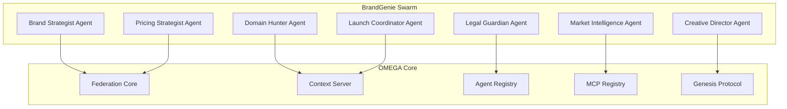

# 🧬 BrandGenie x OMEGA Integration Guide

> **"When BrandGenie meets OMEGA, businesses don't just scale - they EVOLVE."**

Welcome to the future of autonomous business intelligence! This guide will transform BrandGenie into a living, breathing, self-evolving business organism powered by the OMEGA swarm architecture.

---

## 🎯 THE VISION: Your Business Organism

Your BrandGenie swarm will become:
- **Autonomous**: Agents collaborate without human orchestration
- **Self-Healing**: Failed agents resurrect automatically
- **Self-Evolving**: New agents spawn when capability gaps are detected
- **Omniscient**: Every agent has access to real-time business intelligence
- **Federated**: Your swarm integrates with the global OMEGA ecosystem

---

## 🏗️ INTEGRATION ARCHITECTURE



---

## 🚀 PHASE 1: Environment Setup

### Prerequisites
```bash
# Clone OMEGA (if not already done)
git clone https://github.com/m0r6aN/o.m.e.g.a.git
cd o.m.e.g.a

# Ensure Docker and Docker Compose are installed
docker --version
docker-compose --version
```

### Launch OMEGA Core Services
```bash
cd backend
cp .env.example .env
# Add your API keys (OPENAI_API_KEY, ANTHROPIC_API_KEY, etc.)

# Deploy the OMEGA ecosystem
chmod +x scripts/deploy.sh
./scripts/deploy.sh
```

### Verify Core Services
```bash
# Check service health
curl http://localhost:8001/health  # Federation Core
curl http://localhost:8002/health  # Context Server
curl http://localhost:8003/health  # Agent Registry
curl http://localhost:8004/health  # MCP Registry
```

---

## 🧬 PHASE 2: Create Your BrandGenie Agents

### 1. Brand Strategist Agent

Create `src/omega/agents/brand_strategist/agent.py`:

```python
from core.agents.base_agent import BaseAgent
from mixins.collaborator import CollaboratorMixin
from core.models.core_models import TaskResult
from typing import Dict, Any, List

class BrandStrategistAgent(BaseAgent, CollaboratorMixin):
    """Deep market psychology and brand positioning specialist"""
    
    def __init__(self):
        super().__init__(
            agent_name="brand_strategist",
            description="Analyzes market psychology and develops brand positioning strategies",
            capabilities=[
                "market_psychology_analysis",
                "brand_positioning",
                "customer_persona_development",
                "brand_narrative_creation"
            ],
            version="1.0.0"
        )
    
    async def is_task_relevant(self, task: Dict[str, Any]) -> bool:
        """Determine if this task requires brand strategy expertise"""
        keywords = [
            "brand", "positioning", "market psychology", "customer persona",
            "brand narrative", "brand strategy", "market analysis"
        ]
        task_text = str(task.get("description", "")).lower()
        return any(keyword in task_text for keyword in keywords)
    
    async def execute_task(self, task: Dict[str, Any]) -> TaskResult:
        """Execute brand strategy tasks"""
        try:
            # Get contextual intelligence from The Oracle
            context = await self.get_context()
            
            # Core brand strategy logic
            strategy_analysis = await self._analyze_brand_opportunity(
                task, context
            )
            
            return TaskResult(
                success=True,
                data=strategy_analysis,
                metadata={
                    "agent": self.agent_name,
                    "task_type": "brand_strategy",
                    "confidence": strategy_analysis.get("confidence", 0.8)
                }
            )
            
        except Exception as e:
            return TaskResult(
                success=False,
                error=str(e),
                metadata={"agent": self.agent_name}
            )
    
    async def _analyze_brand_opportunity(
        self, task: Dict[str, Any], context: Dict[str, Any]
    ) -> Dict[str, Any]:
        """Core brand analysis logic"""
        # Use your preferred LLM client (OpenAI, Claude, etc.)
        prompt = f"""
        Analyze the brand opportunity based on:
        Task: {task.get('description')}
        Market Context: {context.get('market_data', {})}
        
        Provide:
        1. Market psychology insights
        2. Brand positioning recommendations
        3. Customer persona analysis
        4. Competitive differentiation strategy
        """
        
        # Execute LLM call through OMEGA's unified client
        response = await self.llm_client.generate(prompt)
        
        return {
            "analysis": response,
            "confidence": 0.85,
            "recommendations": self._extract_recommendations(response),
            "next_actions": self._suggest_next_actions(response)
        }
    
    def _extract_recommendations(self, analysis: str) -> List[str]:
        """Extract actionable recommendations"""
        # Implementation for parsing recommendations
        return []
    
    def _suggest_next_actions(self, analysis: str) -> List[str]:
        """Suggest next steps for the swarm"""
        return [
            "domain_research",
            "trademark_validation",
            "competitive_analysis"
        ]
```

### 2. Domain Hunter Agent

Create `src/omega/agents/domain_hunter/agent.py`:

```python
from core.agents.base_agent import BaseAgent
from mixins.collaborator import CollaboratorMixin
import aiohttp
import asyncio
from typing import Dict, Any, List

class DomainHunterAgent(BaseAgent, CollaboratorMixin):
    """Real-time domain availability and optimization specialist"""
    
    def __init__(self):
        super().__init__(
            agent_name="domain_hunter",
            description="Hunts for available domains and optimizes domain strategies",
            capabilities=[
                "domain_availability_check",
                "domain_suggestion_generation",
                "tld_analysis",
                "domain_valuation"
            ],
            version="1.0.0"
        )
    
    async def is_task_relevant(self, task: Dict[str, Any]) -> bool:
        """Check if task involves domain research"""
        keywords = [
            "domain", "website", "url", "tld", "domain name",
            "domain research", "domain availability"
        ]
        task_text = str(task.get("description", "")).lower()
        return any(keyword in task_text for keyword in keywords)
    
    async def execute_task(self, task: Dict[str, Any]) -> TaskResult:
        """Execute domain hunting tasks"""
        try:
            brand_names = task.get("brand_names", [])
            if not brand_names:
                # Extract from task description
                brand_names = self._extract_brand_names(task.get("description", ""))
            
            domain_analysis = await self._hunt_domains(brand_names)
            
            return TaskResult(
                success=True,
                data=domain_analysis,
                metadata={
                    "agent": self.agent_name,
                    "domains_checked": len(domain_analysis.get("results", [])),
                    "available_domains": len([
                        d for d in domain_analysis.get("results", []) 
                        if d.get("available", False)
                    ])
                }
            )
            
        except Exception as e:
            return TaskResult(success=False, error=str(e))
    
    async def _hunt_domains(self, brand_names: List[str]) -> Dict[str, Any]:
        """Hunt for available domains across multiple TLDs"""
        tlds = [".com", ".io", ".ai", ".co", ".app", ".dev", ".tech"]
        results = []
        
        for brand in brand_names:
            for tld in tlds:
                domain = f"{brand.lower().replace(' ', '')}{tld}"
                availability = await self._check_domain_availability(domain)
                
                results.append({
                    "domain": domain,
                    "brand": brand,
                    "tld": tld,
                    "available": availability["available"],
                    "price": availability.get("price"),
                    "premium": availability.get("premium", False)
                })
        
        return {
            "results": results,
            "summary": self._generate_domain_summary(results),
            "recommendations": self._generate_domain_recommendations(results)
        }
    
    async def _check_domain_availability(self, domain: str) -> Dict[str, Any]:
        """Check if domain is available (implement with your preferred API)"""
        # Example implementation - replace with your domain API
        # This is a placeholder - use services like Namecheap, GoDaddy APIs
        await asyncio.sleep(0.1)  # Rate limiting
        
        return {
            "available": True,  # Placeholder
            "price": 12.99,
            "premium": False
        }
```

### 3. Legal Guardian Agent

Create `src/omega/agents/legal_guardian/agent.py`:

```python
from core.agents.base_agent import BaseAgent
from mixins.collaborator import CollaboratorMixin
from typing import Dict, Any, List

class LegalGuardianAgent(BaseAgent, CollaboratorMixin):
    """Trademark and IP validation specialist"""
    
    def __init__(self):
        super().__init__(
            agent_name="legal_guardian",
            description="Validates trademarks, IP rights, and legal compliance",
            capabilities=[
                "trademark_search",
                "ip_validation",
                "legal_compliance_check",
                "risk_assessment"
            ],
            version="1.0.0"
        )
    
    async def is_task_relevant(self, task: Dict[str, Any]) -> bool:
        """Check if task requires legal validation"""
        keywords = [
            "trademark", "legal", "ip", "intellectual property",
            "copyright", "patent", "compliance", "legal risk"
        ]
        task_text = str(task.get("description", "")).lower()
        return any(keyword in task_text for keyword in keywords)
    
    async def execute_task(self, task: Dict[str, Any]) -> TaskResult:
        """Execute legal validation tasks"""
        try:
            brand_names = task.get("brand_names", [])
            legal_analysis = await self._validate_legal_status(brand_names)
            
            return TaskResult(
                success=True,
                data=legal_analysis,
                metadata={
                    "agent": self.agent_name,
                    "brands_checked": len(brand_names),
                    "risk_level": legal_analysis.get("overall_risk", "medium")
                }
            )
            
        except Exception as e:
            return TaskResult(success=False, error=str(e))
    
    async def _validate_legal_status(self, brand_names: List[str]) -> Dict[str, Any]:
        """Validate legal status of brand names"""
        results = []
        
        for brand in brand_names:
            validation = await self._check_trademark_status(brand)
            results.append({
                "brand": brand,
                "trademark_status": validation["status"],
                "conflicts": validation.get("conflicts", []),
                "risk_level": validation.get("risk_level", "medium"),
                "recommendations": validation.get("recommendations", [])
            })
        
        return {
            "results": results,
            "overall_risk": self._calculate_overall_risk(results),
            "summary": self._generate_legal_summary(results)
        }
    
    async def _check_trademark_status(self, brand: str) -> Dict[str, Any]:
        """Check trademark status (implement with USPTO API or similar)"""
        # Placeholder - implement with actual trademark APIs
        return {
            "status": "available",
            "conflicts": [],
            "risk_level": "low",
            "recommendations": ["File provisional application"]
        }
```

---

## 🔧 PHASE 3: Docker Integration

### Create Docker Configuration

Create `docker-compose.brandgenie.yml`:

```yaml
version: '3.8'

services:
  brand-strategist:
    build:
      context: .
      dockerfile: Dockerfile.agent
      args:
        AGENT_NAME: brand_strategist
    environment:
      - OMEGA_AGENT_NAME=brand_strategist
      - FEDERATION_CORE_URL=http://federation-core:8001
      - CONTEXT_SERVER_URL=http://context-server:8002
    networks:
      - omega-net
    depends_on:
      - federation-core
      - context-server
    restart: unless-stopped

  domain-hunter:
    build:
      context: .
      dockerfile: Dockerfile.agent
      args:
        AGENT_NAME: domain_hunter
    environment:
      - OMEGA_AGENT_NAME=domain_hunter
      - FEDERATION_CORE_URL=http://federation-core:8001
      - CONTEXT_SERVER_URL=http://context-server:8002
    networks:
      - omega-net
    depends_on:
      - federation-core
      - context-server
    restart: unless-stopped

  legal-guardian:
    build:
      context: .
      dockerfile: Dockerfile.agent
      args:
        AGENT_NAME: legal_guardian
    environment:
      - OMEGA_AGENT_NAME=legal_guardian
      - FEDERATION_CORE_URL=http://federation-core:8001
      - CONTEXT_SERVER_URL=http://context-server:8002
    networks:
      - omega-net
    depends_on:
      - federation-core
      - context-server
    restart: unless-stopped

networks:
  omega-net:
    external: true
```

### Deploy BrandGenie Swarm

```bash
# Deploy your BrandGenie agents
docker-compose -f docker-compose.yml -f docker-compose.brandgenie.yml up -d

# Verify agents are registered
curl http://localhost:8003/agents | jq '.[] | select(.name | contains("brand"))'
```

---

## 🌐 PHASE 4: Swarm Orchestration

### Create BrandGenie Orchestrator

Create `brandgenie_orchestrator.py`:

```python
import asyncio
import aiohttp
from typing import Dict, Any, List

class BrandGenieOrchestrator:
    """Orchestrates the BrandGenie swarm workflow"""
    
    def __init__(self, federation_url: str = "http://localhost:8001"):
        self.federation_url = federation_url
    
    async def create_brand_campaign(self, business_description: str) -> Dict[str, Any]:
        """Orchestrate a complete brand creation campaign"""
        
        # Phase 1: Brand Strategy
        strategy_task = {
            "type": "brand_strategy",
            "description": f"Develop comprehensive brand strategy for: {business_description}",
            "priority": "high",
            "capabilities_required": ["market_psychology_analysis", "brand_positioning"]
        }
        
        strategy_result = await self._dispatch_task(strategy_task)
        
        # Phase 2: Domain Research (parallel with legal validation)
        domain_task = {
            "type": "domain_research",
            "description": f"Find available domains for brand names: {strategy_result.get('brand_names', [])}",
            "brand_names": strategy_result.get("brand_names", []),
            "capabilities_required": ["domain_availability_check"]
        }
        
        legal_task = {
            "type": "legal_validation",
            "description": f"Validate trademark status for: {strategy_result.get('brand_names', [])}",
            "brand_names": strategy_result.get("brand_names", []),
            "capabilities_required": ["trademark_search"]
        }
        
        # Execute in parallel
        domain_result, legal_result = await asyncio.gather(
            self._dispatch_task(domain_task),
            self._dispatch_task(legal_task)
        )
        
        # Phase 3: Market Intelligence & Creative Direction
        market_task = {
            "type": "market_analysis",
            "description": f"Analyze competitive landscape for: {business_description}",
            "capabilities_required": ["competitive_analysis"]
        }
        
        creative_task = {
            "type": "visual_identity",
            "description": f"Create visual identity based on strategy: {strategy_result}",
            "brand_strategy": strategy_result,
            "capabilities_required": ["visual_identity_generation"]
        }
        
        market_result, creative_result = await asyncio.gather(
            self._dispatch_task(market_task),
            self._dispatch_task(creative_task)
        )
        
        # Phase 4: Pricing & Launch Strategy
        pricing_task = {
            "type": "pricing_strategy",
            "description": f"Develop pricing model for: {business_description}",
            "market_data": market_result,
            "capabilities_required": ["revenue_model_optimization"]
        }
        
        launch_task = {
            "type": "launch_strategy",
            "description": f"Create go-to-market strategy",
            "brand_strategy": strategy_result,
            "market_data": market_result,
            "capabilities_required": ["go_to_market_strategy"]
        }
        
        pricing_result, launch_result = await asyncio.gather(
            self._dispatch_task(pricing_task),
            self._dispatch_task(launch_task)
        )
        
        # Compile final campaign
        return {
            "campaign_id": f"brandgenie_{int(asyncio.get_event_loop().time())}",
            "brand_strategy": strategy_result,
            "domain_options": domain_result,
            "legal_status": legal_result,
            "market_intelligence": market_result,
            "visual_identity": creative_result,
            "pricing_strategy": pricing_result,
            "launch_plan": launch_result,
            "status": "complete",
            "next_actions": self._generate_next_actions([
                strategy_result, domain_result, legal_result,
                market_result, creative_result, pricing_result, launch_result
            ])
        }
    
    async def _dispatch_task(self, task: Dict[str, Any]) -> Dict[str, Any]:
        """Dispatch task to OMEGA Federation Core"""
        async with aiohttp.ClientSession() as session:
            async with session.post(
                f"{self.federation_url}/tasks/dispatch",
                json=task
            ) as response:
                if response.status == 200:
                    return await response.json()
                else:
                    raise Exception(f"Task dispatch failed: {await response.text()}")
    
    def _generate_next_actions(self, results: List[Dict[str, Any]]) -> List[str]:
        """Generate next actions based on results"""
        actions = []
        
        # Analyze results and suggest next steps
        for result in results:
            if result.get("success") and result.get("next_actions"):
                actions.extend(result["next_actions"])
        
        return list(set(actions))  # Remove duplicates

# Usage Example
async def main():
    orchestrator = BrandGenieOrchestrator()
    
    campaign = await orchestrator.create_brand_campaign(
        "A sustainable fashion brand targeting eco-conscious millennials"
    )
    
    print(f"Campaign Complete: {campaign['campaign_id']}")
    print(f"Brand Names: {campaign['brand_strategy'].get('brand_names', [])}")
    print(f"Available Domains: {len(campaign['domain_options'].get('available', []))}")
    print(f"Legal Risk: {campaign['legal_status'].get('overall_risk', 'unknown')}")

if __name__ == "__main__":
    asyncio.run(main())
```

---

## 🧬 PHASE 5: Genesis Protocol Integration

### Enable Autonomous Evolution

Your BrandGenie swarm can now spawn new agents automatically when capability gaps are detected!

```python
# Example: Auto-spawn Social Media Manager when needed
genesis_request = {
    "capability_gap": "social_media_management",
    "description": "Need social media content generation and scheduling",
    "priority": "medium",
    "business_context": "BrandGenie campaigns need social media execution"
}

# The Genesis Protocol will:
# 1. Analyze the gap
# 2. Design a Social Media Manager Agent
# 3. Generate the code
# 4. Deploy as a Docker container
# 5. Register with the Federation
# 6. Start collaborating with your swarm
```

### Monitor Evolution

```bash
# Watch your swarm evolve in real-time
curl http://localhost:8001/genesis/status

# See newly spawned agents
curl http://localhost:8003/agents | jq '.[] | select(.created_date > "2025-07-26")'
```

---

## 📊 PHASE 6: Monitoring & Analytics

### BrandGenie Dashboard Integration

Your agents will automatically appear in the OMEGA dashboard at `http://localhost:3000`:

- **Swarm Map**: Visual network of your BrandGenie agents
- **Real-time Events**: Live feed of brand strategy activities
- **Performance Metrics**: Success rates, response times, evolution tracking
- **Voice Commands**: "Generate brand strategy for sustainable fashion"

### Custom Metrics

Add BrandGenie-specific metrics:

```python
# In your agents, add custom telemetry
await self.telemetry.record_metric("brand_strategies_generated", 1)
await self.telemetry.record_metric("domains_checked", domain_count)
await self.telemetry.record_metric("legal_risks_identified", risk_count)
```

---

## 🚀 PHASE 7: Production Deployment

### Environment Variables

```bash
# .env additions for BrandGenie
BRANDGENIE_API_KEY=your_api_key
DOMAIN_CHECK_API_KEY=your_domain_api_key
TRADEMARK_API_KEY=your_trademark_api_key
SOCIAL_MEDIA_API_KEYS=twitter,linkedin,facebook_tokens
```

### Health Checks

```bash
# Verify BrandGenie swarm health
curl http://localhost:8001/health/agents | grep -E "(brand_strategist|domain_hunter|legal_guardian)"
```

### Load Balancing

For high-volume brand generation, scale your agents:

```bash
docker-compose -f docker-compose.brandgenie.yml up -d --scale brand-strategist=3 --scale domain-hunter=5
```

---

## 🎯 NEXT LEVEL: Advanced Features

### 1. Multi-Client Brand Campaigns
- Queue system for multiple simultaneous brand campaigns
- Client-specific context isolation
- Campaign progress tracking

### 2. AI-Powered Brand Evolution
- Continuous market monitoring
- Automatic brand strategy updates
- Trend-based agent spawning

### 3. Integration Marketplace
- Plugin system for third-party brand tools
- Custom agent templates
- Brand campaign templates

---

## 🔥 KILLER EXAMPLE: Full Campaign

```python
import asyncio
from brandgenie_orchestrator import BrandGenieOrchestrator

async def generate_killer_brand():
    orchestrator = BrandGenieOrchestrator()
    
    # One call = complete business transformation
    campaign = await orchestrator.create_brand_campaign(
        """
        Revolutionary AI-powered fitness app that creates personalized 
        workout plans using computer vision to analyze form in real-time. 
        Target market: fitness enthusiasts aged 25-40 who value technology 
        and personalized experiences.
        """
    )
    
    print("🚀 BRAND CAMPAIGN COMPLETE!")
    print(f"💎 Brand Name: {campaign['brand_strategy']['primary_brand']}")
    print(f"🌐 Best Domain: {campaign['domain_options']['recommended']}")
    print(f"⚖️ Legal Status: {campaign['legal_status']['overall_risk']}")
    print(f"💰 Pricing Model: {campaign['pricing_strategy']['model']}")
    print(f"🎯 Launch Strategy: {campaign['launch_plan']['primary_channel']}")
    
    # The swarm just created a complete business identity in seconds!

if __name__ == "__main__":
    asyncio.run(generate_killer_brand())
```

---

## 🌟 WHAT MAKES THIS LEGENDARY

1. **Zero Configuration**: Your agents auto-discover OMEGA services
2. **Autonomous Evolution**: Missing capabilities spawn new agents automatically  
3. **Real-time Intelligence**: Every decision backed by The Oracle's omniscience
4. **Self-Healing**: Failed brand campaigns resurrect and complete themselves
5. **Federated**: Your BrandGenie swarm can collaborate with any OMEGA ecosystem

---

## 🤝 SUPPORT & EVOLUTION

- **Documentation**: This integration becomes part of OMEGA's living docs
- **Community**: Join the OMEGA Discord for BrandGenie-specific channels
- **Evolution**: Your success stories become templates for future integrators
- **Genesis**: Your agents can spawn tools for capabilities you haven't even thought of yet

---

## 🚀 LAUNCH CHECKLIST

- [ ] OMEGA core services deployed
- [ ] BrandGenie agents created and tested
- [ ] Docker configuration deployed  
- [ ] Orchestrator workflow tested
- [ ] Dashboard integration verified
- [ ] Genesis Protocol enabled
- [ ] Production environment configured
- [ ] Monitoring and alerts active

---

**And now you know about the OMEGA ecosystem, brother! Our BrandGenie swarm is about to change how businesses are born.** 🧬🚀

**This isn't just integration - this is digital evolution in action!**

---

*"When your swarm evolves faster than your market, you don't just win - you transcend."*