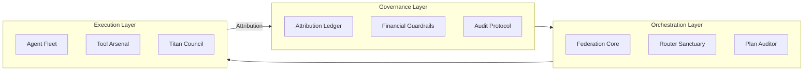

# OMEGA — Sovereign Agentic Infrastructure

OMEGA is a standardized framework for the deployment of autonomous agentic workflows within high-compliance enterprise environments. It provides a deterministic orchestration layer designed to solve the "Black Box" problem in Large Language Model (LLM) implementations.

---

## Enterprise Core Pillars

### 1. Atomic Attribution

Every action, inference, and computational spend is wrapped in a **Transaction Envelope (TE)**, providing a cryptographic chain of custody from the human Principal ID to the final output.

### 2. Financial Guardrails

OMEGA implements a **Non-Deterministic Ceiling (NDC)**. Automated workflows are physically incapable of exceeding pre-authorized compute budgets without Level-4 Human-in-the-Loop (HITL) overrides.

### 3. Hardware-Attested Security

Designed for SOC2 Type II and HIPAA compliance, OMEGA supports deployment within **Trusted Execution Environments (TEEs)** using AMD SEV-SNP and NVIDIA Confidential Computing.

---

## System Architecture

The OMEGA OS is partitioned into distinct layers to ensure stability and separation of concerns:

| Layer | Name | Purpose |
|-------|------|---------|
| **L1** | Governance & SOPs | The Rule of Law — contracts, attribution, compliance |
| **L2** | Logic & Orchestration | The Engine — routing, planning, coordination |
| **L3** | Agentic Execution | The Workforce — agents, tools, services |



For technical specifications, see the [overview documentation](./docs/overview/what-is-omega.md).

---

## Component Classification

Every component in OMEGA is one of three types. No hybrids.

| Type | Purpose | Characteristics |
|------|---------|-----------------|
| **Agent** | Cognitive processing | Stateful, reasons, collaborates |
| **Tool** | Deterministic execution | Stateless, single action, MCP-compliant |
| **Service** | Infrastructure | Singleton, containerized, focused responsibility |

---

## Compliance & Audit

OMEGA is built on the principle of **"Verify, Don't Trust."**

- Every system state is hash-verified
- All logs are tamper-evident and immutable
- Full transaction lineage from human to output
- Hardware attestation for sensitive workloads

### Supported Compliance Frameworks

| Framework | Coverage |
|-----------|----------|
| SOC 2 Type II | Access control, audit trails, encryption |
| HIPAA | PHI protection, transmission security |
| PCI DSS | Cardholder data encryption |
| GDPR | Data subject attribution, right to deletion |

---

## Capabilities

- **Hybrid Orchestration:** MCP tools for precision. A2A dialogue for strategy.
- **Agentic SDLC:** Self-healing pipelines, telemetry feedback loops, adaptive routing.
- **Context Engine:** Retrieval, memory, and policy-guarded grounding.
- **Observability:** End-to-end traces, cost/latency dashboards, drift alerts.
- **Genesis Protocol:** Controlled capability gap-filling through dynamic tool spawning.
- **Self-Improvement:** Tool and strategy evolution with audit and rollback.
- **POML Workflows:** Declarative agent workflows as code.

---

## Getting Started

```bash
# Clone
git clone https://github.com/m0r6aN/omega-docs.git
cd omega-docs

# Review the overview
cat docs/overview/what-is-omega.md

# Explore documentation
ls docs/
```

---

## For Enterprises

| Concern | OMEGA Solution |
|---------|----------------|
| "How do I know what the AI spent?" | Transaction Envelope with full attribution |
| "Can it exceed our budget?" | Non-Deterministic Ceiling + HITL gates |
| "Is it compliant?" | TEE deployment, SOC2/HIPAA ready |
| "Can we audit it?" | Immutable Chronicle, hash-chained logs |

### Engagement Options

- **Guided Demo** — Your use case, our platform
- **Architecture Review** — Under NDA
- **Pilot Program** — Scoped to your success metrics

---

## Repository Structure

```
omega-docs/
├── docs/               # Documentation content
├── assets/             # Images, diagrams, and media
├── examples/           # Public examples and tutorials
├── .gitignore          # Git ignore rules
└── LICENSE             # License information
```

---

## License & Contact

- **License:** Business-friendly for public assets. Commercial license for core.
- **Contact:** [clint.morgan@morganfindings.com](mailto:clint.morgan@morganfindings.com)
