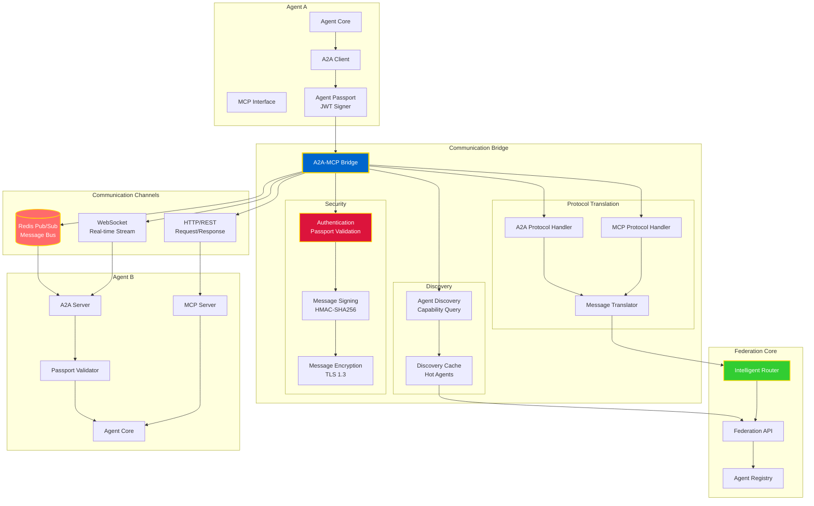
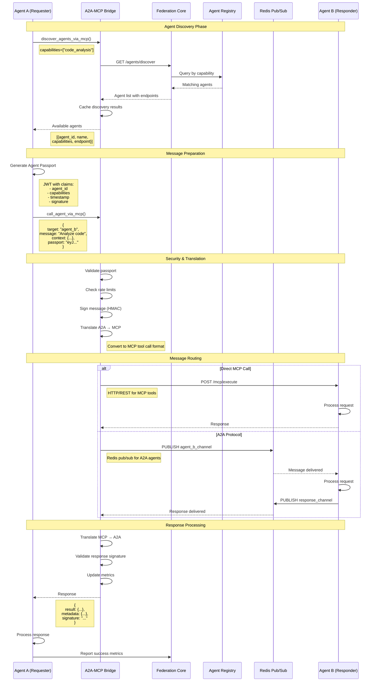

# Agent-to-Agent (A2A) Communication Protocol



## A2A Communication Flow



## Communication Patterns

### 1. Request-Response (Synchronous)
Direct call with immediate response:

```python
from bridges.a2a_mcp_bridge import A2AMCPBridge

bridge = A2AMCPBridge(
    agent_registry_url="http://agent_registry:9401",
    federation_url="http://federation_core:9405"
)

# Synchronous call
response = await bridge.call_agent_via_mcp(
    agent_id="code_analyzer",
    message={
        "action": "analyze",
        "code": "def hello(): pass",
        "language": "python"
    }
)

print(response["result"])
```

### 2. Pub/Sub (Asynchronous)
Fire-and-forget or event-driven:

```python
from omega.communication import RedisClient

redis = RedisClient()

# Publish event
await redis.publish(
    channel="code_analysis_requests",
    message={
        "task_id": "task_12345",
        "code": "...",
        "requester": "agent_a"
    }
)

# Subscribe to responses
async for message in redis.subscribe("code_analysis_results"):
    if message["task_id"] == "task_12345":
        print(message["result"])
        break
```

### 3. Streaming (Real-time)
WebSocket for continuous data flow:

```python
import websockets

async with websockets.connect("ws://agent_b:8080/stream") as ws:
    # Send request
    await ws.send(json.dumps({
        "action": "analyze_stream",
        "source": "file.py"
    }))
    
    # Receive streaming results
    async for message in ws:
        data = json.loads(message)
        print(f"Progress: {data['progress']}%")
        if data["complete"]:
            break
```

### 4. Broadcast (One-to-Many)
Notify multiple agents:

```python
# Broadcast to all agents with capability
agents = await bridge.discover_agents_via_mcp(
    capabilities=["notification_handler"]
)

for agent in agents:
    await bridge.call_agent_via_mcp(
        agent_id=agent["agent_id"],
        message={
            "type": "system_alert",
            "severity": "high",
            "message": "Database failover initiated"
        }
    )
```

## Security Features

### Agent Passport (JWT)
Every agent has a cryptographic identity:

```json
{
  "header": {
    "alg": "HS256",
    "typ": "JWT"
  },
  "payload": {
    "agent_id": "code_generator_001",
    "capabilities": ["code_generation", "architecture_design"],
    "issued_at": 1691234567,
    "expires_at": 1691238167,
    "issuer": "federation_core",
    "signature": "..."
  }
}
```

### Message Signing
All messages are signed with HMAC-SHA256:

```python
import hmac
import hashlib

def sign_message(message: dict, secret: str) -> str:
    """Sign message with HMAC-SHA256."""
    payload = json.dumps(message, sort_keys=True)
    signature = hmac.new(
        secret.encode(),
        payload.encode(),
        hashlib.sha256
    ).hexdigest()
    return signature
```

### Encryption
TLS 1.3 for all network communication:
- **In-transit**: TLS 1.3 encryption
- **At-rest**: AES-256 for stored messages
- **End-to-end**: Optional for sensitive data

### Rate Limiting
Per-agent quotas to prevent abuse:

```python
rate_limits = {
    "requests_per_minute": 100,
    "requests_per_hour": 5000,
    "max_message_size_kb": 1024,
    "max_concurrent_requests": 10
}
```

## Protocol Comparison

| Feature | A2A Protocol | MCP Protocol |
|---------|-------------|--------------|
| **Transport** | Redis Pub/Sub, WebSocket | HTTP/REST |
| **State** | Stateful (agent context) | Stateless (tool calls) |
| **Discovery** | Capability-based | Tool catalog |
| **Security** | Agent Passport + mTLS | API keys + HTTPS |
| **Use Case** | Agent collaboration | Tool invocation |
| **Latency** | Low (< 10ms) | Medium (< 100ms) |
| **Scalability** | High (pub/sub) | Medium (HTTP) |

## Bridge Benefits

The A2A-MCP Bridge provides:

1. **Unified Interface**: Single API for all agent communication
2. **Protocol Translation**: Seamless A2A ↔ MCP conversion
3. **Discovery**: Find agents by capability, not endpoint
4. **Security**: Automatic passport validation and signing
5. **Resilience**: Circuit breakers and retry logic
6. **Observability**: Built-in metrics and tracing

## Example: Multi-Agent Collaboration

```python
from bridges.a2a_mcp_bridge import A2AMCPBridge

class CodeReviewOrchestrator:
    def __init__(self):
        self.bridge = A2AMCPBridge(
            agent_registry_url="http://agent_registry:9401",
            federation_url="http://federation_core:9405"
        )
    
    async def review_code(self, code: str):
        """Orchestrate multi-agent code review."""
        
        # Step 1: Analyze code structure
        analysis = await self.bridge.call_agent_via_mcp(
            agent_id="code_analyzer",
            message={"action": "analyze", "code": code}
        )
        
        # Step 2: Security scan
        security = await self.bridge.call_agent_via_mcp(
            agent_id="security_scanner",
            message={"action": "scan", "code": code}
        )
        
        # Step 3: Quality check
        quality = await self.bridge.call_agent_via_mcp(
            agent_id="quality_checker",
            message={"action": "check", "code": code}
        )
        
        # Step 4: Generate report
        report = await self.bridge.call_agent_via_mcp(
            agent_id="report_generator",
            message={
                "action": "merge",
                "inputs": [analysis, security, quality]
            }
        )
        
        return report
```

**This is the way.** 🔱

