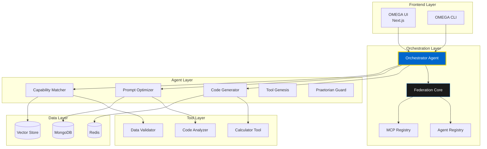
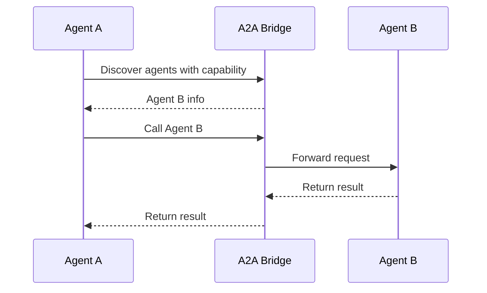
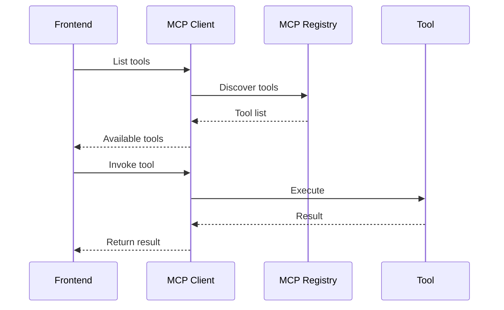
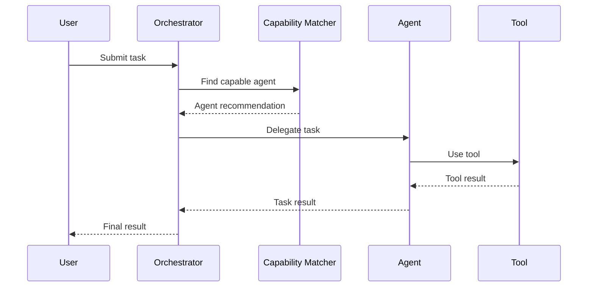
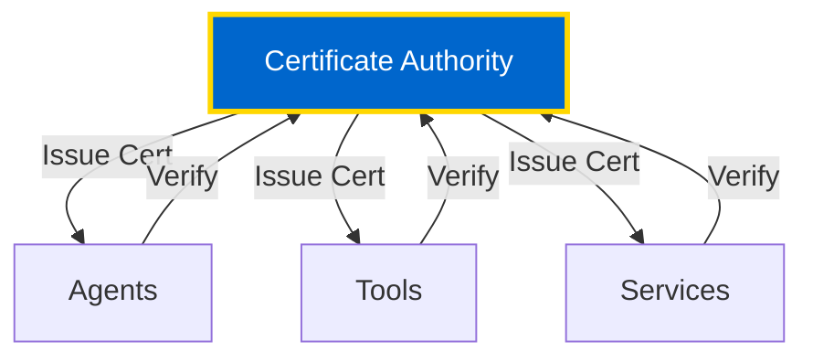

# Architecture Overview

Comprehensive architectural blueprint of the OMEGA multi-agent orchestration platform.

## 🏛️ System Architecture

OMEGA is built on a **microservices architecture** with distributed agents, centralized orchestration, and federated service discovery.




> Ingress & Identity: OMEGA uses a gateway-first, portless identity model. See Gateway Ingress and Portless Identities: /docs/operations/gateway-ingress

---

## 🎯 Core Components

### 1. Orchestration Layer

**Federation Core** (`port 9405`)
- Service discovery and registration
- FastMCP directory resources
- Agent-to-Agent communication bridge
- Health monitoring and metrics

**Agent Registry** (`port 9401`)
- Agent lifecycle management
- Capability registration
- Agent discovery and routing

**MCP Registry** (`port 9402`)
- Tool registration and discovery
- MCP protocol management
- Tool invocation routing

### 2. Agent Layer

**Orchestrator Agent** (`port 9000`)
- Master coordinator
- Task routing and delegation
- Workflow orchestration
- Agent supervision

**Specialized Agents:**
- **Code Generator** - Code generation from natural language
- **Prompt Optimizer** - Prompt enhancement and refinement
- **Capability Matcher** - Intelligent task routing
- **Tool Genesis** - Autonomous tool creation
- **Praetorian Guard** - System health monitoring

### 3. Tool Layer

**Pure OmegaTools:**
- **Calculator** - Mathematical operations
- **Code Analyzer** - Static code analysis
- **Data Validator** - Schema validation
- **Ask Sage** - Knowledge retrieval

### 4. Data Layer

**MongoDB** (`port 27017`)
- Persistent agent state
- Task history and results
- Configuration storage
- Audit logs

**Redis** (`port 6379`)
- Real-time caching
- Pub/Sub messaging
- Session management
- Rate limiting

**Vector Store** (Qdrant)
- Semantic search
- Memory retrieval
- Context matching

---

## 📁 Directory Structure

### Core Repository

```
OMEGA/
├── core/                       # Core platform
│   ├── agents/                 # Agent implementations
│   │   ├── base_agent.py       # Base agent class
│   │   ├── orchestrator/       # Master orchestrator
│   │   ├── code_master/        # Code generation
│   │   ├── praetorian_guard/   # Health monitoring
│   │   └── titans/             # Titan agents (GPT, Claude, etc.)
│   │
│   ├── tools/                  # Tool implementations
│   │   ├── base_tool.py        # OmegaTool base class
│   │   ├── calculator/         # Math tool
│   │   ├── ask_sage/           # Knowledge tool
│   │   └── code_analyzer/      # Analysis tool
│   │
│   ├── services/               # Core services
│   │   ├── federation_core/    # Service discovery
│   │   ├── agent_registry/     # Agent management
│   │   ├── mcp_registry/       # Tool registry
│   │   └── context_server/     # Context management
│   │
│   ├── models/                 # Data models
│   │   ├── task_models.py      # Task envelopes
│   │   ├── agent_models.py     # Agent schemas
│   │   └── tool_models.py      # Tool schemas
│   │
│   ├── config/                 # Configuration
│   │   ├── settings.py         # Settings management
│   │   ├── manager.py          # Config manager
│   │   └── keys.py             # Config keys enum
│   │
│   └── security/               # Security layer
│       ├── encryption.py       # Encryption utilities
│       ├── signing.py          # Message signing
│       └── tool_certification.py # CA for tools
│
├── frontend/                   # UI layer
│   ├── src/
│   │   ├── app/                # Next.js app router
│   │   ├── components/         # React components
│   │   ├── lib/                # Utilities
│   │   └── hooks/              # Custom hooks
│   │
│   └── public/                 # Static assets
│
├── docs/                       # Documentation
│   ├── doctrine/               # Sacred doctrine
│   ├── architecture/           # Architecture docs
│   ├── developer/              # Developer guides
│   └── api/                    # API reference
│
├── ops/                        # Operations
│   ├── docker/                 # Docker configs
│   ├── k8s/                    # Kubernetes manifests
│   └── scripts/                # Deployment scripts
│
└── tests/                      # Test suites
    ├── unit/                   # Unit tests
    ├── integration/            # Integration tests
    └── e2e/                    # End-to-end tests
```

---

## 🔄 Communication Patterns

### 1. Agent-to-Agent (A2A)



### 2. Model Context Protocol (MCP)



### 3. Task Orchestration



---

## 🏗️ Design Principles

### 1. Trinity Architecture

**The Three Pillars:**
- **Agents** (WHO) - Stateful, cognitive entities
- **Tools** (WHAT) - Pure, stateless functions
- **Services** (WHERE) - Infrastructure and support

### 2. Separation of Concerns

**Agents:**
- Maintain state and memory
- Make decisions
- Orchestrate workflows
- Learn and adapt

**Tools:**
- Execute pure functions
- No side effects
- Deterministic results
- Zero state retention

**Services:**
- Provide infrastructure
- Manage resources
- Enable communication
- Ensure reliability

### 3. Federation Architecture

**Service Discovery:**
- Dynamic registration
- Health monitoring
- Capability-based routing
- Automatic failover

**Load Distribution:**
- Round-robin routing
- Capability matching
- Priority queuing
- Backpressure handling

---

## 🔐 Security Architecture

### Five Rings of Defense

1. **Network Perimeter** - Firewall, VPN, DDoS protection
2. **Authentication Layer** - JWT, OAuth2, mTLS
3. **Authorization Layer** - RBAC, policy enforcement
4. **Encryption Layer** - TLS, at-rest encryption
5. **Audit Layer** - Logging, monitoring, alerting

### Certificate Authority



---

## 📊 Data Flow

### Task Execution Flow

1. **User Request** → Orchestrator
2. **Orchestrator** → Capability Matcher
3. **Capability Matcher** → Agent Selection
4. **Agent** → Tool Invocation
5. **Tool** → Execution
6. **Result** → Agent Processing
7. **Agent** → Orchestrator Response
8. **Orchestrator** → User Result

### Memory & Learning Flow

1. **Task Completion** → Memory Storage
2. **Memory Storage** → Vector Embedding
3. **Vector Store** → Semantic Index
4. **Future Tasks** → Context Retrieval
5. **Context** → Enhanced Decision Making

---

## 🚀 Scalability Patterns

### Horizontal Scaling

- **Agent Replication** - Multiple instances per agent type
- **Load Balancing** - Distribute requests across replicas
- **Sharding** - Partition data by domain or tenant

### Vertical Scaling

- **Resource Allocation** - CPU/Memory optimization per service
- **Caching** - Redis for frequently accessed data
- **Connection Pooling** - Reuse database connections

### Auto-Scaling

```yaml
apiVersion: autoscaling/v2
kind: HorizontalPodAutoscaler
metadata:
  name: orchestrator-hpa
spec:
  scaleTargetRef:
    apiVersion: apps/v1
    kind: Deployment
    name: orchestrator
  minReplicas: 2
  maxReplicas: 10
  metrics:
  - type: Resource
    resource:
      name: cpu
      target:
        type: Utilization
        averageUtilization: 70
```

---

## 📚 Next Steps

- [Deployment Guide](/docs/operations/deployment) - Production deployment
- [Security Fortress](/docs/security/fortress) - Security implementation
- [Developer Guide](/docs/developer/overview) - Build with OMEGA

**🏛️ The architecture is the foundation. Build upon it wisely.**
