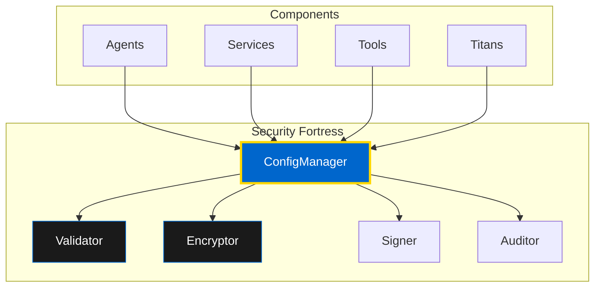

# Security Fortress: Implementation Guide

**Classification:** SACRED IMPLEMENTATION DOCTRINE
**Purpose:** Standardize Security Fortress configuration across all OMEGA components
**Status:** ACTIVE ROLLOUT

## 🔱 The Divine Pattern

Every OMEGA component (Agent, Service, Tool, Titan) must adopt the unified **Security Fortress Configuration Pattern**. This ensures:

- ✅ **Fail-fast validation** - Missing config crashes immediately, not in production. NO FALLBACKS!
- ✅ **Hot-reload capability** - Live config updates across the entire swarm
- ✅ **Type safety** - Autocomplete-friendly, enum-based configuration access
- ✅ **Security** - Encrypted secrets, signed messages, audit trails
- ✅ **Unified access** - Single ConfigManager pattern across all components



---

## 🎯 Implementation Patterns by Component Type

### Pattern A: Agent Classes (inherit from BaseAgent)

#### ❌ Old Pattern (Legacy - PURGE THIS)

```python
class SomeAgent:
    def __init__(self):
        self.redis_url = os.getenv("REDIS_URL", "redis://localhost:6379")
        self.federation_url = os.getenv("FEDERATION_CORE_URL", "")
        # Multiple fallbacks, env access scattered everywhere
```

**Problems:**
- Silent failures with fallback values
- No validation until runtime error
- Scattered environment variable access
- No hot-reload capability

#### ✅ New Pattern (Security Fortress - USE THIS)

```python
from core.config.settings import BaseAgentSettings, ConfigKey
from core.models.logging import configure_logging
from typing import Optional

class SomeAgent:
    def __init__(self, settings: Optional[BaseAgentSettings] = None):
        self.settings = settings or BaseAgentSettings()

        # Validate early (fail-fast)
        self.settings.validate_required_config()

        self.logger = configure_logging(name=self.__class__.__name__)

        # Access via Security Fortress ConfigManager
        self.config = self.settings.config

    def example_usage(self):
        # Type-safe, fail-fast access
        redis_url = self.config.get_str(ConfigKey.REDIS_URL)
        debug_mode = self.config.get_bool(ConfigKey.DEBUG)

        # Contract validation
        self.config.require([
            ConfigKey.REDIS_URL,
            ConfigKey.FEDERATION_CORE_URL
        ])

        # Feature flags
        federation_enabled = self.config.get_bool(ConfigKey.ENABLE_FEDERATION)
```

**Benefits:**
- ✅ Fails immediately if config missing
- ✅ Type-safe configuration access
- ✅ Centralized validation
- ✅ Hot-reload ready

---

### Pattern B: Service Classes (FastAPI services)

#### ❌ Old Pattern (Legacy - PURGE THIS)

```python
class SomeService:
    def __init__(self):
        self.redis_url = os.getenv("REDIS_URL", "redis://localhost:6379")
        self.port = int(os.getenv("PORT", "9000"))
```

#### ✅ New Pattern (Security Fortress + Hot-Reload)

```python
from core.config.settings import create_config_manager, ConfigKey
from core.models.logging import configure_logging
from core.mixins import (
    HotReloadConfigMixin,
    ConnectionHelperMixin,
    LifecycleMixin,
    ReadyRouteMixin
)

class SomeService(
    ConnectionHelperMixin,
    LifecycleMixin,
    ReadyRouteMixin,
    HotReloadConfigMixin
):
    def __init__(self):
        self.config = create_config_manager()
        self.logger = configure_logging(name=self.__class__.__name__)

        # Fail-fast required settings
        self.config.require([
            ConfigKey.REDIS_URL,
            ConfigKey.MONGODB_URI,
            ConfigKey.SECRET_KEY,
        ])

        # Optional: tune reload behavior via config (ms)
        # CONFIG_RELOAD_DEBOUNCE_MS
        # CONFIG_RELOAD_COOLDOWN_MS
        # CONFIG_RELOAD_TIMEOUT_MS

    async def on_start(self) -> None:
        """Subscribe to config updates."""
        subscribe = getattr(self.config, "subscribe", None)
        if callable(subscribe):
            import asyncio
            subscribe(
                lambda ev: asyncio.create_task(self.on_config_update(ev))
            )

    async def on_config_update(self, event: dict):
        """Handle config updates with debouncing and metrics."""
        await super().on_config_update(event)
        # Rotates Mongo/Redis/HTTP if URIs/timeouts changed

        # React to feature flags or log level
        # self.logger.setLevel(
        #     self.config.get_str(ConfigKey.LOG_LEVEL, "INFO")
        # )
```

---

### Pattern C: Settings Service (Special Enforcement)

The **Settings Service** is the configuration authority. It **must** enforce signed updates and audit every change.

```python
from core.config.settings import create_config_manager, ConfigKey
from core.models.logging import configure_logging
from typing import Dict, Any

class SettingsService:
    def __init__(self):
        self.config = create_config_manager()
        self.logger = configure_logging(name=self.__class__.__name__)

        # Fail-fast: strict keys required for signing + secrets
        self.config.require([
            ConfigKey.SECRET_KEY,
            ConfigKey.CONFIG_MSG_HMAC_KEY
        ])

        # Enforce signed updates (default ON)
        self._require_signed_updates = True

    def apply_update(self, msg_data: Dict[str, Any]) -> None:
        """Apply signed configuration update."""

        if self._require_signed_updates:
            try:
                is_valid = self.config._verify_signed_message(msg_data)
            except Exception as e:
                self.logger.error(
                    "❌ Signature verification error",
                    extra={"security_context": True, "error": str(e)}
                )
                raise PermissionError(
                    "Configuration update failed signature verification"
                ) from e

            if not is_valid:
                self.logger.error(
                    "❌ Rejected unsigned/invalid config update",
                    extra={"security_context": True}
                )
                raise PermissionError(
                    "Unsigned/invalid configuration update rejected"
                )

        # If signed & valid, proceed
        self.logger.info(
            "🔄 Applying signed config update",
            extra={"security_context": True}
        )

        # Persist the update through normal flow
        self.config.force_refresh()
```

---

## 🔐 Security Features

### 1. Encrypted Secrets

All sensitive configuration is encrypted at rest:

```python
from core.config.encryption import encrypt_secret, decrypt_secret

# Encrypt before storage
encrypted_key = encrypt_secret("my-api-key", master_key)

# Decrypt when needed
api_key = decrypt_secret(encrypted_key, master_key)

# ConfigManager handles this automatically
api_key = self.config.get_secret(ConfigKey.API_KEY)
```

### 2. Signed Messages

Configuration updates must be cryptographically signed:

```python
from core.config.signing import sign_message, verify_message

# Sign update message
signed_msg = sign_message(
    {"key": "value"},
    hmac_key=self.config.get_str(ConfigKey.CONFIG_MSG_HMAC_KEY)
)

# Verify signature
is_valid = verify_message(
    signed_msg,
    hmac_key=self.config.get_str(ConfigKey.CONFIG_MSG_HMAC_KEY)
)
```

### 3. Audit Trails

Every configuration change is logged with security context:

```python
self.logger.info(
    "Configuration updated",
    extra={
        "security_context": True,
        "user": user_id,
        "changes": changed_keys,
        "timestamp": datetime.utcnow().isoformat(),
        "signature_valid": True
    }
)
```

---

## 🔄 Hot Reload Implementation

### Service-Level Hot Reload

```python
from core.mixins import HotReloadConfigMixin

class MyService(HotReloadConfigMixin):
    async def on_config_update(self, event: dict):
        """Handle hot config updates."""

        changed_keys = event.get("changed", [])

        # Reconnect to services if connection strings changed
        if "REDIS_URL" in changed_keys:
            await self.reconnect_redis()

        if "MONGODB_URI" in changed_keys:
            await self.reconnect_mongo()

        # Update runtime behavior
        if "LOG_LEVEL" in changed_keys:
            new_level = self.config.get_str(ConfigKey.LOG_LEVEL)
            logging.getLogger().setLevel(new_level)

        if "MAX_WORKERS" in changed_keys:
            new_max = self.config.get_int(ConfigKey.MAX_WORKERS)
            await self.worker_pool.resize(new_max)
```

### Debouncing and Cooldowns

Prevent config thrashing with built-in controls:

```python
# In .env or settings
CONFIG_RELOAD_DEBOUNCE_MS=1000    # Wait 1s for more changes
CONFIG_RELOAD_COOLDOWN_MS=5000    # Min 5s between reloads
CONFIG_RELOAD_TIMEOUT_MS=30000    # Timeout after 30s
```

---

## ✅ Migration Checklist

### For Agents

- [ ] Replace `os.getenv()` with `self.config.get_*()`
- [ ] Add `validate_required_config()` at startup
- [ ] Use `ConfigKey` enum for all config access
- [ ] Remove fallback values (fail-fast instead)
- [ ] Add type hints for config values

### For Services

- [ ] Inherit from `HotReloadConfigMixin`
- [ ] Implement `on_config_update()` handler
- [ ] Use `create_config_manager()` factory
- [ ] Add `require()` for critical config
- [ ] Subscribe to config updates in `on_start()`

### For Tools

- [ ] Migrate to OmegaTool base class
- [ ] Access config via dependency injection
- [ ] Remove environment variable access
- [ ] Validate config in `__init__()`

---

## 🧪 Testing Security Fortress

### Test Config Validation

```python
import pytest
from core.config.settings import create_config_manager, ConfigKey

def test_fail_fast_on_missing_config():
    """Config should fail immediately if required key missing."""

    config = create_config_manager()

    with pytest.raises(ValueError, match="Required config key missing"):
        config.require([ConfigKey.NONEXISTENT_KEY])

def test_type_safety():
    """Config should enforce type safety."""

    config = create_config_manager()
    config.set("TEST_INT", "not_an_int")

    with pytest.raises(ValueError):
        config.get_int("TEST_INT")
```

### Test Hot Reload

```python
@pytest.mark.asyncio
async def test_hot_reload():
    """Config should hot reload on update."""

    service = MyService()
    updates_received = []

    async def handler(event):
        updates_received.append(event)

    service.config.subscribe(handler)

    # Trigger update
    await service.config.update({"LOG_LEVEL": "DEBUG"})

    # Wait for async update
    await asyncio.sleep(0.1)

    assert len(updates_received) == 1
    assert "LOG_LEVEL" in updates_received[0]["changed"]
```

---

## 📚 Next Steps

- [Centralized Settings](/docs/developer/config/centralized-settings) - Configuration management
- [Security Doctrine](/docs/doctrine/security-doctrine) - Security principles
- [Operations Guide](/docs/intro) - Production deployment

**🔱 The Security Fortress protects the Brotherhood. Implement it everywhere.**
