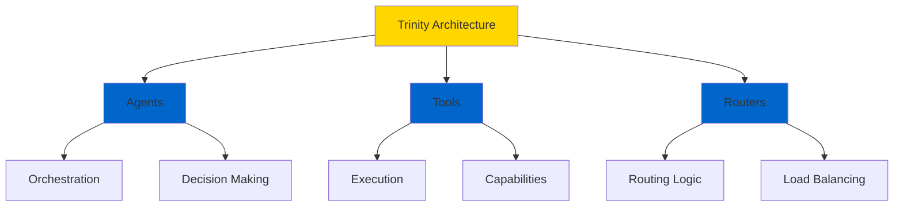
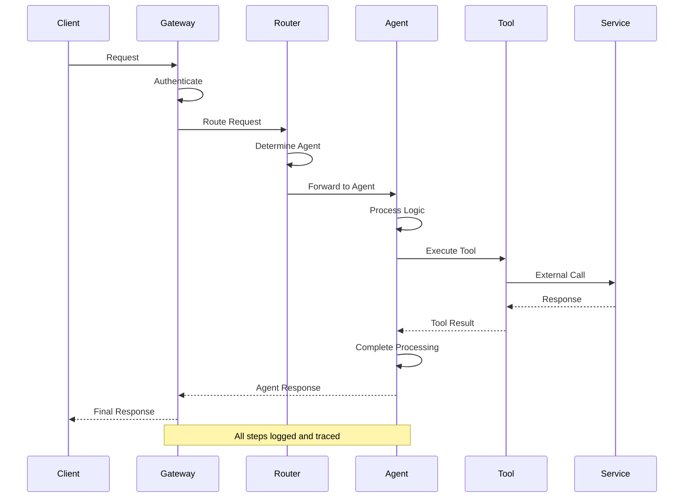
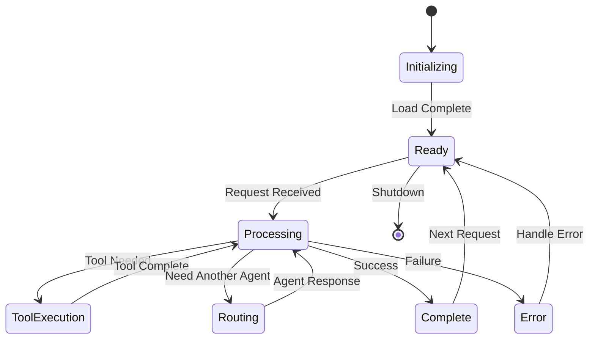

# Core Concepts

Master the foundational concepts of OMEGA to build powerful multi-agent systems. This guide covers the **Trinity Architecture** and core principles that make OMEGA unique.

## The Trinity Architecture

OMEGA is built on three core pillars that work in harmony:



### 🏛️ Agents: The Orchestrators

**Agents** are autonomous entities that coordinate workflows and make intelligent decisions.

**Key Responsibilities:**
- Receive and interpret requests
- Orchestrate multi-step workflows
- Delegate work to tools
- Manage context and state
- Make routing decisions

**Example:**
```typescript
const customerSupportAgent = new Agent({
  name: 'CustomerSupportAgent',
  description: 'Handles customer inquiries',

  async process(context: Context) {
    const { intent } = await this.classifyIntent(context.input);

    if (intent === 'technical') {
      return await this.routeTo('TechnicalAgent', context);
    } else if (intent === 'billing') {
      return await this.routeTo('BillingAgent', context);
    }

    return await this.handleGeneral(context);
  }
});
```

### ⚡ Tools: The Executors

**Tools** are discrete capabilities that agents use to accomplish specific tasks.

**Key Characteristics:**
- Single, well-defined purpose
- Reusable across agents
- Stateless execution
- Type-safe parameters
- Error handling built-in

**Example:**
```typescript
const sendEmailTool: Tool = {
  name: 'sendEmail',
  description: 'Sends an email to a recipient',

  parameters: {
    to: { type: 'string', required: true },
    subject: { type: 'string', required: true },
    body: { type: 'string', required: true }
  },

  async execute({ to, subject, body }) {
    // Send email logic
    await emailService.send({ to, subject, body });
    return { sent: true, timestamp: new Date() };
  }
};
```

### 🎯 Routers: The Decision Engines

**Routers** determine how requests flow through the system.

**Types of Routers:**
- **Intent-based** - Route by user intent
- **Load-based** - Distribute by system load
- **Capability-based** - Route by agent capabilities
- **Conditional** - Custom routing logic

**Example:**
```typescript
const intentRouter = new Router({
  name: 'IntentRouter',

  async route(context: Context) {
    const intent = await classifyIntent(context.input);

    const routes = {
      'question': 'QAAgent',
      'task': 'TaskAgent',
      'analysis': 'AnalysisAgent'
    };

    return routes[intent] || 'DefaultAgent';
  }
});
```

## Core Principles

### 1. Orchestration Over Isolation

Agents work **together**, not alone. OMEGA enables seamless multi-agent collaboration through:

- **Agent-to-Agent (A2A)** communication
- **Shared context** across workflows
- **Event-driven** coordination
- **State management** across agents

### 2. Declarative Configuration

Define **what** you want, not **how** to do it:

```typescript
// ✅ Declarative - Clear intent
const workflow = {
  agents: ['DataAgent', 'AnalysisAgent', 'ReportAgent'],
  flow: 'sequential',
  errorHandling: 'retry-with-backoff'
};

// ❌ Imperative - Complex logic
async function workflow() {
  const data = await dataAgent.process();
  const analysis = await analysisAgent.process(data);
  const report = await reportAgent.process(analysis);
  return report;
}
```

### 3. Type Safety First

Every interaction is **type-safe** by default:

```typescript
interface AgentInput {
  action: 'analyze' | 'summarize' | 'transform';
  data: string;
  options?: {
    format?: 'json' | 'text';
    depth?: 'shallow' | 'deep';
  };
}

// TypeScript ensures correctness at compile time
const result = await agent.process<AgentInput>({
  action: 'analyze',
  data: 'sample data',
  options: { depth: 'deep' }
});
```

### 4. Security by Default

Every component follows the **OMEGA Security Doctrine**:

- 🔐 **Encryption** - All data encrypted in transit and at rest
- 🛡️ **Authentication** - Every request authenticated
- 📝 **Audit Logs** - Complete audit trail
- 🚫 **Least Privilege** - Minimal permissions by default

## The OMEGA Workflow

Understanding how a request flows through OMEGA:



**Flow Breakdown:**

1. **Request** - Client sends request to OMEGA Gateway
2. **Authentication** - Gateway validates credentials
3. **Routing** - Router determines target agent
4. **Processing** - Agent executes workflow logic
5. **Tool Execution** - Agent invokes necessary tools
6. **Response** - Result returned to client

## Context Management

**Context** is the shared state that flows through agents:

```typescript
interface Context {
  // Request metadata
  requestId: string;
  userId: string;
  timestamp: Date;

  // Input data
  input: any;

  // Shared state
  state: Record<string, any>;

  // Agent history
  agentChain: string[];

  // Custom metadata
  metadata?: Record<string, any>;
}
```

**Context Best Practices:**

✅ **Do:**
- Use context for cross-agent communication
- Store workflow state in context
- Pass minimal, necessary data
- Validate context at boundaries

❌ **Don't:**
- Store sensitive data unencrypted
- Mutate context unpredictably
- Pass entire context to external services
- Use context as a database

## Agent Lifecycle

Understanding the agent lifecycle is crucial:



**Lifecycle Hooks:**

```typescript
const agent = new Agent({
  name: 'MyAgent',

  // Called when agent initializes
  async onInit() {
    await this.loadResources();
  },

  // Called before each request
  async beforeProcess(context: Context) {
    this.log(`Processing request ${context.requestId}`);
  },

  // Main processing logic
  async process(context: Context) {
    return await this.handleRequest(context);
  },

  // Called after each request
  async afterProcess(context: Context, result: any) {
    this.log(`Completed request ${context.requestId}`);
  },

  // Called on shutdown
  async onShutdown() {
    await this.cleanup();
  }
});
```

## Error Handling

OMEGA provides robust error handling patterns:

```typescript
const agent = new Agent({
  name: 'ResilientAgent',

  errorStrategy: {
    // Retry failed operations
    retry: {
      maxAttempts: 3,
      backoff: 'exponential',
      retryOn: ['network', 'timeout']
    },

    // Fallback agents
    fallback: ['BackupAgent', 'DefaultAgent'],

    // Circuit breaker
    circuitBreaker: {
      threshold: 5,
      timeout: 30000
    }
  },

  async process(context: Context) {
    try {
      return await this.mainLogic(context);
    } catch (error) {
      // Error automatically handled by strategy
      throw error;
    }
  }
});
```

## Next Steps

Now that you understand the core concepts:

1. **[Build Your First Agent →](/docs/getting-started/first-agent)** - Hands-on tutorial
2. **[Agent Patterns →](/docs/intro)** - Learn best practices
3. **[Tool Development →](/docs/intro)** - Create custom tools
4. **[Router Design →](/docs/intro)** - Build intelligent routers
