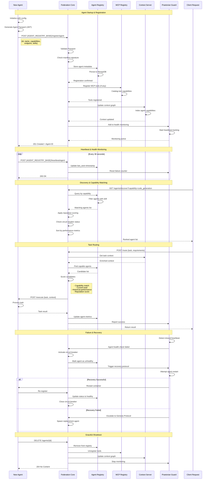

# Agent Registration & Discovery Flow



## Registration Protocol

### 1. Agent Initialization
```json
{
  "agent_id": "code_generator_001",
  "name": "Code Generator",
  "description": "Transforms requirements into production code",
  "capabilities": ["code_generation", "architecture_design"],
  "skills": ["python", "typescript", "docker"],
  "endpoint": "http://code-generator:8080",
  "mcp_endpoint": "http://code-generator:8080/mcp",
  "version": "1.0.0",
  "passport": "eyJhbGciOiJIUzI1NiIsInR5cCI6IkpXVCJ9..."
}
```

### 2. Discovery Query
```json
{
  "capabilities": ["code_generation"],
  "skills": ["python"],
  "min_reputation": 0.8,
  "max_results": 5
}
```

### 3. Discovery Response
```json
{
  "agents": [
    {
      "agent_id": "code_generator_001",
      "name": "Code Generator",
      "capabilities": ["code_generation", "architecture_design"],
      "reputation_score": 0.95,
      "avg_latency_ms": 150,
      "success_rate": 0.98,
      "current_load": 0.3,
      "endpoint": "http://code-generator:8080"
    }
  ],
  "total": 1,
  "query_time_ms": 12
}
```

## Health Monitoring

### Heartbeat Protocol
- **Interval**: 30 seconds
- **Timeout**: 90 seconds (3 missed heartbeats)
- **Payload**: `{"status": "healthy", "load": 0.3, "metrics": {...}}`

### Health States
- **HEALTHY**: Receiving regular heartbeats
- **DEGRADED**: Slow responses or high error rate
- **UNHEALTHY**: Missed heartbeats or circuit breaker open
- **OFFLINE**: Gracefully unregistered or terminated

### Circuit Breaker
- **Closed**: Normal operation
- **Open**: Too many failures, route around agent
- **Half-Open**: Testing recovery, limited traffic

