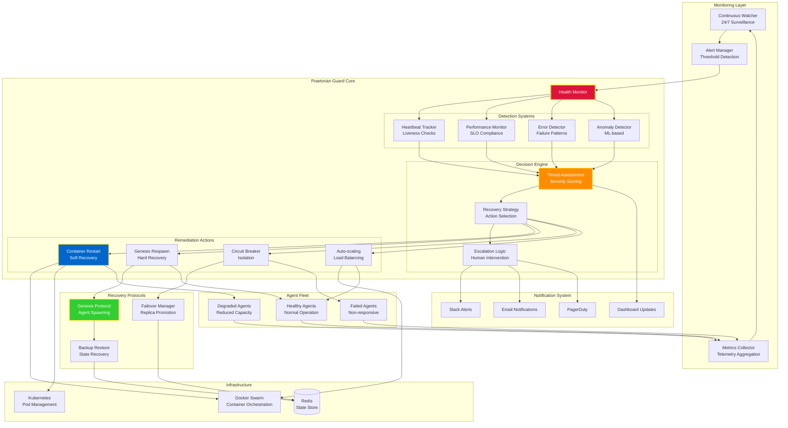

# Praetorian Guard - Self-Healing Architecture



## Praetorian Guard Workflow

```mermaid
sequenceDiagram
    participant PG as Praetorian Guard
    participant Agent as Monitored Agent
    participant Fed as Federation Core
    participant Docker as Docker Swarm
    participant Genesis as Genesis Protocol
    participant Ops as Operations Team

    Note over PG,Ops: Normal Operation - Heartbeat Monitoring

    loop Every 30 seconds
        Agent->>Fed: POST /heartbeat
        Fed->>PG: Update agent status
        PG->>PG: Reset failure counter
    end

    Note over PG,Ops: Failure Detection

    PG->>PG: Heartbeat timeout (90s)
    PG->>PG: Increment failure counter
    
    PG->>Agent: Health check probe
    Note right of PG: GET /health

    alt Agent Responds
        Agent-->>PG: 200 OK
        PG->>PG: Reset failure counter
        PG->>Fed: Update status: DEGRADED
    else No Response
        PG->>PG: Mark as FAILED
        PG->>Fed: Update status: FAILED
        PG->>PG: Activate recovery protocol
    end

    Note over PG,Ops: Threat Assessment

    PG->>PG: Analyze failure pattern
    Note right of PG: - Failure count<br/>- Error rate<br/>- Performance metrics<br/>- Historical data

    PG->>PG: Calculate severity score
    Note right of PG: Score: 8/10 (Critical)

    PG->>PG: Select recovery strategy
    
    alt Severity: Low (1-3)
        PG->>Docker: Restart container
        Docker->>Docker: docker restart agent
        Docker-->>PG: Container restarted
        
        PG->>Agent: Wait for startup
        Agent->>Fed: Re-register
        PG->>Fed: Update status: HEALTHY
        
    else Severity: Medium (4-6)
        PG->>Docker: Force recreate container
        Docker->>Docker: docker rm + docker run
        Docker-->>PG: New container started
        
        PG->>Genesis: Restore agent state
        Genesis->>Genesis: Load from backup
        Genesis-->>PG: State restored
        
        Agent->>Fed: Re-register
        PG->>Fed: Update status: HEALTHY
        
    else Severity: High (7-8)
        PG->>Genesis: Trigger genesis respawn
        Genesis->>Genesis: Spawn new agent instance
        Genesis->>Docker: Deploy container
        Docker-->>Genesis: Deployed
        
        Genesis->>Genesis: Restore state + config
        Genesis-->>PG: New agent operational
        
        PG->>Fed: Register new agent
        PG->>Fed: Deregister failed agent
        
    else Severity: Critical (9-10)
        PG->>Ops: Escalate to human
        Note right of PG: Slack + PagerDuty alert
        
        PG->>Fed: Activate circuit breaker
        Fed->>Fed: Route around failed agent
        
        PG->>Genesis: Prepare replacement
        
        Ops->>PG: Approve recovery
        PG->>Genesis: Execute respawn
        Genesis-->>PG: Replacement ready
    end

    Note over PG,Ops: Post-Recovery Monitoring

    PG->>Agent: Enhanced monitoring (5min)
    loop Every 10 seconds
        PG->>Agent: Health check
        Agent-->>PG: Status report
    end

    PG->>PG: Validate recovery success
    
    alt Recovery Successful
        PG->>Fed: Update status: HEALTHY
        PG->>Fed: Close circuit breaker
        PG->>Ops: Send success notification
    else Recovery Failed
        PG->>Ops: Escalate to critical
        PG->>Fed: Keep circuit breaker open
        PG->>Genesis: Attempt alternative strategy
    end

    Note over PG,Ops: Continuous Learning

    PG->>PG: Store failure pattern
    PG->>PG: Update ML model
    PG->>PG: Refine recovery strategies
```



## Health Check Types

### 1. Liveness Probe
Determines if agent is alive:

```python
@app.get("/health/live")
async def liveness():
    """Basic liveness check."""
    return {"status": "alive", "timestamp": datetime.utcnow()}
```

### 2. Readiness Probe
Determines if agent can handle requests:

```python
@app.get("/health/ready")
async def readiness():
    """Check if agent is ready to serve."""
    checks = {
        "database": await check_database(),
        "redis": await check_redis(),
        "dependencies": await check_dependencies()
    }
    
    all_ready = all(checks.values())
    status_code = 200 if all_ready else 503
    
    return JSONResponse(
        status_code=status_code,
        content={"ready": all_ready, "checks": checks}
    )
```

### 3. Performance Probe
Monitors SLO compliance:

```python
@app.get("/health/performance")
async def performance():
    """Report performance metrics."""
    return {
        "avg_latency_ms": 150,
        "p95_latency_ms": 280,
        "p99_latency_ms": 450,
        "error_rate": 0.02,
        "requests_per_second": 45,
        "cpu_usage": 0.35,
        "memory_usage_mb": 512
    }
```

## Recovery Strategies

### Level 1: Soft Restart
Quick container restart for transient issues:

```bash
# Docker Swarm
docker service update --force agent_service

# Kubernetes
kubectl rollout restart deployment/agent-deployment
```

**Use When**:
- Transient network issues
- Memory leaks (temporary fix)
- Configuration reload needed

**Recovery Time**: 10-30 seconds

### Level 2: Hard Restart
Full container recreation:

```bash
# Docker
docker rm -f agent_container
docker run -d --name agent_container agent_image

# Kubernetes
kubectl delete pod agent-pod
# Pod automatically recreated by deployment
```

**Use When**:
- Corrupted container state
- Persistent errors
- Resource exhaustion

**Recovery Time**: 30-60 seconds

### Level 3: Genesis Respawn
Autonomous agent recreation:

```python
from procreate import genesis_respawn

# Trigger genesis protocol
success = await genesis_respawn(
    agent_id="code_generator_001",
    restore_state=True,
    config_override={
        "memory_limit": "2GB",  # Increase resources
        "timeout": 300
    }
)
```

**Use When**:
- Repeated failures
- Agent corruption
- Version upgrade needed

**Recovery Time**: 1-3 minutes

### Level 4: Human Escalation
Critical issues requiring operator intervention:

```python
# Escalation criteria
if (
    failure_count > 5 or
    severity_score >= 9 or
    data_loss_risk or
    security_incident
):
    await escalate_to_human(
        severity="critical",
        agent_id=agent_id,
        failure_details=details,
        recommended_action="manual_investigation"
    )
```

**Use When**:
- Security incidents
- Data corruption risk
- Unknown failure patterns
- Regulatory compliance issues

## Monitoring Metrics

### Agent Health Score
Composite score (0-100):

```python
def calculate_health_score(agent_metrics):
    """Calculate agent health score."""
    weights = {
        "uptime": 0.3,
        "success_rate": 0.3,
        "latency": 0.2,
        "error_rate": 0.2
    }
    
    score = (
        weights["uptime"] * agent_metrics["uptime_percentage"] +
        weights["success_rate"] * agent_metrics["success_rate"] * 100 +
        weights["latency"] * (1 - agent_metrics["p95_latency"] / 1000) * 100 +
        weights["error_rate"] * (1 - agent_metrics["error_rate"]) * 100
    )
    
    return max(0, min(100, score))
```

### SLO Compliance
Service Level Objectives tracking:

```yaml
slo_targets:
  availability: 99.9%        # 43 minutes downtime/month
  latency_p95: 200ms         # 95th percentile
  latency_p99: 500ms         # 99th percentile
  error_rate: 0.1%           # 1 error per 1000 requests
  success_rate: 99.5%        # Task completion rate
```

### Anomaly Detection
ML-based pattern recognition:

```python
from sklearn.ensemble import IsolationForest

class AnomalyDetector:
    def __init__(self):
        self.model = IsolationForest(contamination=0.1)
        self.trained = False
    
    def detect(self, metrics):
        """Detect anomalous behavior."""
        features = [
            metrics["latency"],
            metrics["error_rate"],
            metrics["cpu_usage"],
            metrics["memory_usage"]
        ]
        
        if not self.trained:
            return False
        
        prediction = self.model.predict([features])
        return prediction[0] == -1  # -1 indicates anomaly
```

## The SURVIVE Imperative

> **"The swarm never dies. It heals itself."**

The Praetorian Guard embodies OMEGA's commitment to autonomous resilience:

- **Zero Human Intervention**: Self-healing without operator action
- **Predictive Recovery**: ML-based failure prediction
- **Graceful Degradation**: Circuit breakers prevent cascade failures
- **Continuous Learning**: Each failure improves future responses

**This is the way.** 🛡️

