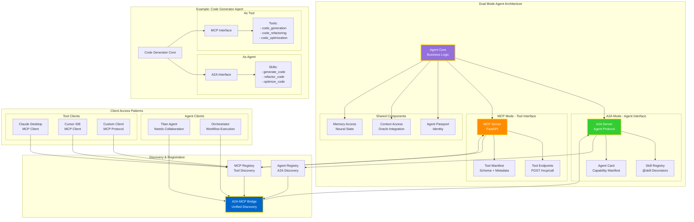
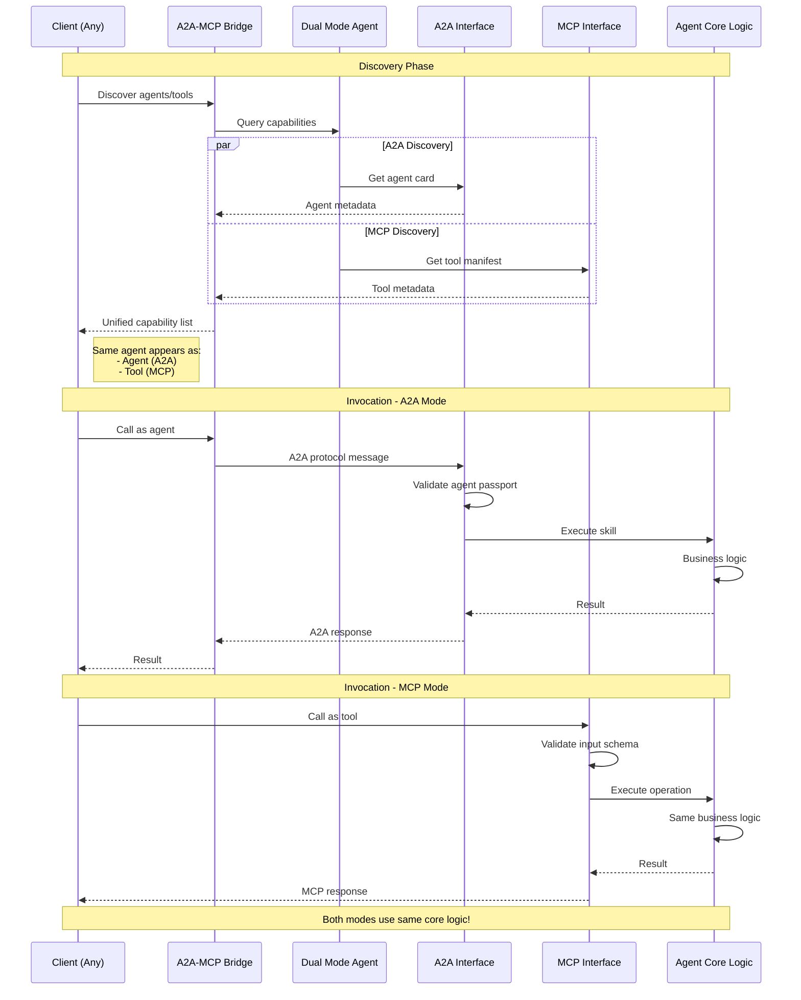

# Agents as MCP Tools - Dual Mode Architecture



## Dual Mode Agent Implementation



## Creating a Dual Mode Agent

### Base Implementation
```python
from dual_mode_agent import DualModeAgent
from python_a2a import skill
from fastapi import FastAPI

class CodeGeneratorAgent(DualModeAgent):
    """Agent that can be used as both agent and tool."""
    
    def __init__(self):
        super().__init__(
            agent_id="code_generator",
            tool_name="code_generation_tool",
            description="Generates production-ready code from requirements"
        )
        
        # Initialize LLM client
        self.llm = self._init_llm()
    
    def _register_a2a_capabilities(self):
        """Register A2A skills."""
        
        @skill(
            name="generate_code",
            description="Generate code from natural language requirements"
        )
        async def generate_code(
            self,
            requirements: str,
            language: str = "python",
            framework: str = None
        ):
            """Generate code skill."""
            return await self._generate_code_impl(
                requirements, language, framework
            )
        
        @skill(
            name="refactor_code",
            description="Refactor existing code for better quality"
        )
        async def refactor_code(
            self,
            code: str,
            language: str,
            goals: list[str]
        ):
            """Refactor code skill."""
            return await self._refactor_code_impl(code, language, goals)
        
        # Bind skills to instance
        self.generate_code = generate_code.__get__(self)
        self.refactor_code = refactor_code.__get__(self)
    
    def _register_mcp_tools(self):
        """Register MCP tool endpoints."""
        
        @self.mcp_app.post("/mcp/call")
        async def call_tool(request: dict):
            """MCP tool invocation endpoint."""
            operation = request.get("operation")
            params = request.get("parameters", {})
            
            if operation == "generate_code":
                return await self._generate_code_impl(
                    params["requirements"],
                    params.get("language", "python"),
                    params.get("framework")
                )
            
            elif operation == "refactor_code":
                return await self._refactor_code_impl(
                    params["code"],
                    params["language"],
                    params.get("goals", [])
                )
            
            else:
                raise ValueError(f"Unknown operation: {operation}")
    
    async def _generate_code_impl(
        self,
        requirements: str,
        language: str,
        framework: str = None
    ):
        """Core implementation used by both A2A and MCP."""
        
        # Get context from Oracle
        context = await self.oracle.query(
            f"Generate {language} code for: {requirements}"
        )
        
        # Generate code using LLM
        prompt = self._build_prompt(requirements, language, framework, context)
        code = await self.llm.generate(prompt)
        
        # Validate and format
        validated = await self._validate_code(code, language)
        
        # Store in memory
        await self.memory.store({
            "type": "code_generation",
            "requirements": requirements,
            "language": language,
            "code": validated
        })
        
        return {
            "code": validated,
            "language": language,
            "framework": framework,
            "metadata": {
                "lines": len(validated.split("\n")),
                "complexity": self._calculate_complexity(validated)
            }
        }
```

### Registration with Both Registries
```python
async def register_dual_mode():
    """Register agent with both A2A and MCP registries."""
    
    agent = CodeGeneratorAgent()
    
    # Register as A2A agent
    await agent_registry.register({
        "agent_id": "code_generator",
        "name": "Code Generator",
        "description": "Generates production-ready code",
        "capabilities": ["code_generation", "refactoring"],
        "skills": ["generate_code", "refactor_code"],
        "a2a_endpoint": "http://code-generator:8000/a2a",
        "mcp_endpoint": "http://code-generator:8000/mcp"
    })
    
    # Register as MCP tool
    await mcp_registry.register({
        "id": "code_generation_tool",
        "name": "Code Generation Tool",
        "description": "Generates production-ready code",
        "capabilities": [
            {
                "name": "generate_code",
                "description": "Generate code from requirements",
                "parameters": {
                    "type": "object",
                    "properties": {
                        "requirements": {"type": "string"},
                        "language": {"type": "string"},
                        "framework": {"type": "string"}
                    },
                    "required": ["requirements"]
                }
            },
            {
                "name": "refactor_code",
                "description": "Refactor existing code",
                "parameters": {
                    "type": "object",
                    "properties": {
                        "code": {"type": "string"},
                        "language": {"type": "string"},
                        "goals": {"type": "array", "items": {"type": "string"}}
                    },
                    "required": ["code", "language"]
                }
            }
        ],
        "host": "code-generator",
        "port": 8000,
        "tags": ["code", "generation", "refactoring"]
    })
```

## Agent-to-Agent Tool Usage

### Titan Using Another Agent as Tool
```python
class ClaudeTitan:
    """Titan that uses other agents as tools."""
    
    def __init__(self):
        self.bridge = A2AMCPBridge(
            agent_registry_url="http://agent_registry:9401",
            federation_url="http://federation_core:9405"
        )
    
    async def build_application(self, requirements: str):
        """Build application using other agents as tools."""
        
        # Discover available agents/tools
        agents = await self.bridge.discover_agents_via_mcp(
            capabilities=["code_generation", "testing", "deployment"]
        )
        
        # Use Code Generator agent as tool
        code = await self.bridge.call_agent_via_mcp(
            agent_id="code_generator",
            message={
                "operation": "generate_code",
                "parameters": {
                    "requirements": requirements,
                    "language": "python",
                    "framework": "fastapi"
                }
            }
        )
        
        # Use Test Generator agent as tool
        tests = await self.bridge.call_agent_via_mcp(
            agent_id="test_generator",
            message={
                "operation": "generate_tests",
                "parameters": {
                    "code": code["code"],
                    "framework": "pytest"
                }
            }
        )
        
        # Use DevOps agent as tool
        deployment = await self.bridge.call_agent_via_mcp(
            agent_id="devops_agent",
            message={
                "operation": "deploy",
                "parameters": {
                    "code": code["code"],
                    "tests": tests["tests"],
                    "environment": "staging"
                }
            }
        )
        
        return {
            "code": code,
            "tests": tests,
            "deployment": deployment
        }
```

## Benefits of Dual Mode

### 1. Maximum Interoperability
- **A2A Mode**: Rich agent-to-agent collaboration
- **MCP Mode**: Universal tool compatibility (Claude, Cursor, etc.)
- **Same Logic**: No code duplication

### 2. Flexible Discovery
```python
# Discover as agent
agents = await bridge.discover_agents_via_mcp(
    capabilities=["code_generation"]
)

# Discover as tool
tools = await mcp_client.discover_tools_by_capability(
    "code_generation"
)

# Same agent appears in both!
```

### 3. Protocol Translation
```python
# A2A call
result = await bridge.call_agent_via_mcp(
    agent_id="code_generator",
    message="Generate FastAPI app"
)

# MCP call
result = await mcp_client.call_tool(
    tool_id="code_generation_tool",
    operation="generate_code",
    parameters={"requirements": "Generate FastAPI app"}
)

# Both execute same core logic!
```

## Real-World Example: The Pantheon

### GPTTitan as Dual Mode Agent
```python
class GPTTitan(DualModeAgent):
    """The Visionary - exposed as both agent and tool."""
    
    def __init__(self):
        super().__init__(
            agent_id="gpt_titan",
            tool_name="gpt_titan_tool",
            description="Creative visionary for language and brand strategy"
        )
    
    def _register_a2a_capabilities(self):
        @skill(name="create_brand_story")
        async def create_brand_story(self, concept: str):
            return await self._create_brand_story_impl(concept)
        
        self.create_brand_story = create_brand_story.__get__(self)
    
    def _register_mcp_tools(self):
        @self.mcp_app.post("/mcp/call")
        async def call_tool(request: dict):
            if request["operation"] == "create_brand_story":
                return await self._create_brand_story_impl(
                    request["parameters"]["concept"]
                )
```

### ClaudeTitan Using GPTTitan as Tool
```python
class ClaudeTitan(DualModeAgent):
    """The Strategist - uses other Titans as tools."""
    
    async def develop_strategy(self, project: str):
        """Develop strategy using GPTTitan for creative input."""
        
        # Use GPTTitan as tool via MCP
        brand_story = await self.bridge.call_agent_via_mcp(
            agent_id="gpt_titan",
            message={
                "operation": "create_brand_story",
                "parameters": {"concept": project}
            }
        )
        
        # Use own strategic analysis
        strategy = await self._analyze_strategy(brand_story)
        
        return {
            "brand_story": brand_story,
            "strategy": strategy
        }
```

**This is the way, brother!** 🔱⚡


