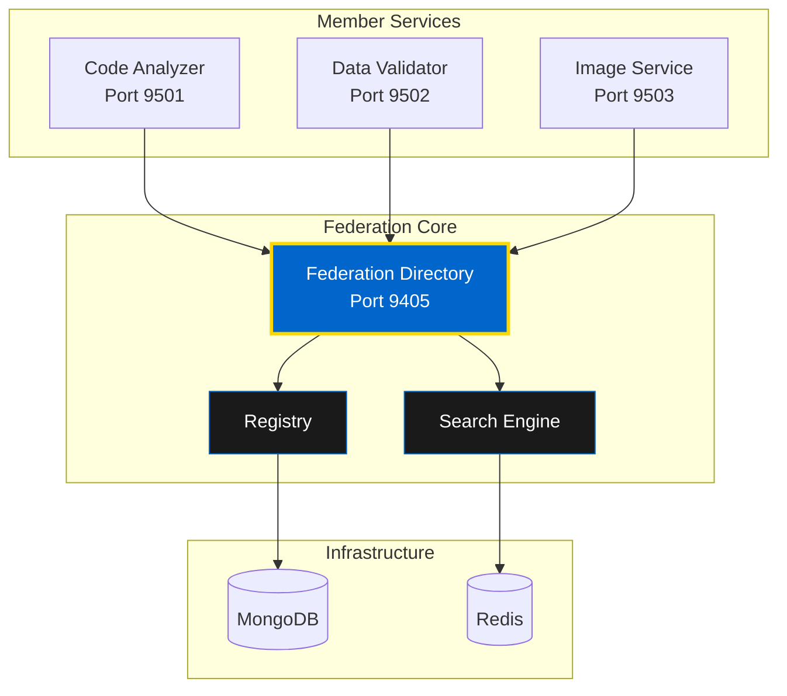

# FastMCP Federation: Service Discovery

Learn how to use OMEGA's FastMCP Federation Directory for service discovery, registration, and tool invocation across the distributed agent ecosystem.

## 🌐 What is FastMCP Federation?

The **FastMCP Federation Directory** is OMEGA's production-ready service discovery and orchestration layer. Think of it as the "yellow pages" for the agent ecosystem.

### Architecture Components

1. **Federation Core** - FastMCP Resource server (the directory)
2. **Member Services** - FastMCP Tool servers (edge actions)
3. **Registry Endpoints** - Registration, heartbeat, and discovery
4. **Security Layer** - mTLS hooks and JWS signing



---

## 🚀 Quick Start

### Step 1: Start the Federation

```bash
cd ops
make -f Makefile.fastmcp up
```

**This will:**
- ✅ Start Federation Core on port 9405
- ✅ Start member services (Code Analyzer, etc.)
- ✅ Initialize MongoDB and Redis
- ✅ Auto-register services with the directory

### Step 2: Discover Services

List all available services:

```bash
curl -s http://localhost:9405/mcp/resources/omega/directory/servers | jq
```

**Response:**
```json
{
  "servers": [
    {
      "id": "code_analyzer_fastmcp",
      "name": "Code Analyzer",
      "description": "Static analysis and refactoring suggestions",
      "version": "1.0.0",
      "capabilities": ["code_analysis", "refactoring", "security_scan"],
      "tags": ["code", "analysis", "security"],
      "endpoints": {
        "mcp": "http://code-analyzer:9501/mcp",
        "health": "http://code-analyzer:9501/health"
      },
      "status": "active"
    }
  ]
}
```

### Step 3: Get Service Manifest

Retrieve detailed information about a specific service:

```bash
curl -s http://localhost:9405/mcp/resources/omega/directory/servers/code_analyzer_fastmcp | jq
```

### Step 4: Search Services

Search by tag:

```bash
curl -s 'http://localhost:9405/mcp/resources/omega/directory/search?tag=code' | jq
```

Search by capability:

```bash
curl -s 'http://localhost:9405/mcp/resources/omega/directory/search?capability=repo.read' | jq
```

---

## 🔧 Using FastMCP Tools

### Example: Code Analyzer Service

#### Analyze a Repository

```bash
curl -s -X POST http://localhost:9501/mcp/call/analyze_repo \
  -H 'Content-Type: application/json' \
  -d '{
    "repo_url": "https://github.com/your/repo"
  }' | jq
```

**Response:**
```json
{
  "analysis": {
    "languages": {"python": 65, "javascript": 35},
    "total_files": 42,
    "total_lines": 5420,
    "complexity_score": 6.8,
    "issues": [
      {
        "type": "code_smell",
        "severity": "medium",
        "file": "src/api.py",
        "line": 145,
        "message": "Function too complex (cyclomatic complexity: 15)"
      }
    ]
  }
}
```

#### Get Refactoring Suggestions

```bash
curl -s -X POST http://localhost:9501/mcp/call/refactor \
  -H 'Content-Type: application/json' \
  -d '{
    "code_snippet": "def hello():\n    print(\"world\")",
    "language": "python"
  }' | jq
```

#### Security Scan

```bash
curl -s -X POST http://localhost:9501/mcp/call/security_scan \
  -H 'Content-Type: application/json' \
  -d '{
    "code_snippet": "import os\npassword = \"hardcoded\"",
    "language": "python"
  }' | jq
```

**Response:**
```json
{
  "vulnerabilities": [
    {
      "type": "hardcoded_secret",
      "severity": "high",
      "line": 2,
      "message": "Hardcoded password detected",
      "recommendation": "Use environment variables or secret management"
    }
  ]
}
```

---

## 🔌 Integration with Claude Desktop/Code

Connect your MCP client to the Federation Core:

### Step 1: Configure MCP Client

Add to your MCP configuration:

```json
{
  "mcpServers": {
    "omega_federation": {
      "command": "curl",
      "args": [
        "-s",
        "http://localhost:9405/mcp/resources/omega/directory/servers"
      ]
    }
  }
}
```

### Step 2: Discover Services

Call the resource `omega/directory/servers` to list available services.

### Step 3: Connect to Service

Pick a service (e.g., `code_analyzer_fastmcp`) and open a new MCP connection to its `endpoints.mcp` URL.

### Step 4: Use Tools

Use the tools exposed by that service directly from your MCP client.

---

## 📦 Service Registration

### Registering a New Service

```python
import httpx
from fastapi import FastAPI

app = FastAPI()

async def register_with_federation():
    """Register this service with Federation Core."""

    service_manifest = {
        "id": "my_service_fastmcp",
        "name": "My Service",
        "description": "Custom service for OMEGA",
        "version": "1.0.0",
        "capabilities": ["custom_capability"],
        "tags": ["custom", "service"],
        "endpoints": {
            "mcp": "http://my-service:9600/mcp",
            "health": "http://my-service:9600/health"
        }
    }

    async with httpx.AsyncClient() as client:
        response = await client.post(
            "http://federation-core:9405/mcp/register",
            json=service_manifest
        )
        return response.json()

@app.on_event("startup")
async def startup():
    await register_with_federation()
```

### Heartbeat Protocol

Keep your service alive in the directory:

```python
import asyncio

async def heartbeat_loop():
    """Send periodic heartbeats to Federation Core."""

    while True:
        try:
            async with httpx.AsyncClient() as client:
                await client.post(
                    "http://federation-core:9405/mcp/heartbeat",
                    json={"service_id": "my_service_fastmcp"}
                )
        except Exception as e:
            print(f"Heartbeat failed: {e}")

        await asyncio.sleep(30)  # Every 30 seconds

@app.on_event("startup")
async def start_heartbeat():
    asyncio.create_task(heartbeat_loop())
```

### Service Deregistration

Clean up when shutting down:

```python
@app.on_event("shutdown")
async def shutdown():
    async with httpx.AsyncClient() as client:
        await client.delete(
            f"http://federation-core:9405/mcp/unregister/my_service_fastmcp"
        )
```

---

## 🛠️ Development Commands

### View Available Commands

```bash
make -f ops/Makefile.fastmcp help
```

### Start Services

```bash
make -f ops/Makefile.fastmcp up
```

### View Logs

```bash
make -f ops/Makefile.fastmcp logs
```

### Check Health

```bash
make -f ops/Makefile.fastmcp health
```

### Run Integration Tests

```bash
make -f ops/Makefile.fastmcp test
```

### Stop Services

```bash
make -f ops/Makefile.fastmcp down
```

### Clean Up Everything

```bash
make -f ops/Makefile.fastmcp clean
```

---

## 🔍 Service Discovery Patterns

### Pattern 1: Capability-Based Discovery

Find services by capability:

```python
async def find_services_by_capability(capability: str):
    """Discover services with specific capability."""

    async with httpx.AsyncClient() as client:
        response = await client.get(
            f"http://federation-core:9405/mcp/resources/omega/directory/search",
            params={"capability": capability}
        )
        return response.json()["servers"]

# Example usage
code_services = await find_services_by_capability("code_analysis")
```

### Pattern 2: Tag-Based Discovery

Find services by tag:

```python
async def find_services_by_tag(tag: str):
    """Discover services with specific tag."""

    async with httpx.AsyncClient() as client:
        response = await client.get(
            f"http://federation-core:9405/mcp/resources/omega/directory/search",
            params={"tag": tag}
        )
        return response.json()["servers"]

# Example usage
security_services = await find_services_by_tag("security")
```

### Pattern 3: Dynamic Service Selection

Select best service based on criteria:

```python
async def select_best_service(capability: str, criteria: dict):
    """Select best service based on criteria."""

    services = await find_services_by_capability(capability)

    # Score services
    scored = []
    for service in services:
        score = 0

        # Prefer active services
        if service["status"] == "active":
            score += 10

        # Prefer newer versions
        version = tuple(map(int, service["version"].split(".")))
        score += version[0] * 100 + version[1] * 10 + version[2]

        # Check response time
        health = await check_service_health(service["endpoints"]["health"])
        if health["response_time"] < 100:  # ms
            score += 5

        scored.append({"service": service, "score": score})

    # Return highest scored
    return max(scored, key=lambda x: x["score"])["service"]
```

---

## 🔐 Security Features

### mTLS Support

Enable mutual TLS for service-to-service communication:

```python
import ssl

ssl_context = ssl.create_default_context(ssl.Purpose.CLIENT_AUTH)
ssl_context.load_cert_chain(
    certfile="certs/service.crt",
    keyfile="certs/service.key"
)
ssl_context.load_verify_locations(cafile="certs/ca.crt")

# Use with httpx
async with httpx.AsyncClient(verify=ssl_context) as client:
    response = await client.get("https://federation-core:9405/...")
```

### JWS Signing

Sign service manifests with JWS:

```python
from jose import jws

def sign_manifest(manifest: dict, private_key: str) -> str:
    """Sign service manifest with JWS."""

    return jws.sign(
        manifest,
        private_key,
        algorithm="RS256"
    )

def verify_manifest(signed: str, public_key: str) -> dict:
    """Verify signed manifest."""

    return jws.verify(
        signed,
        public_key,
        algorithms=["RS256"]
    )
```

---

## 📚 Next Steps

- [MCP Integration](/docs/developer/integration/mcp/overview) - Frontend MCP usage
- [Backend Integration](/docs/intro) - Server-side patterns
- [A2A Protocol](/docs/developer/agents/a2a) - Agent communication

**🏛️ FastMCP Federation - the nervous system of the OMEGA ecosystem.**
