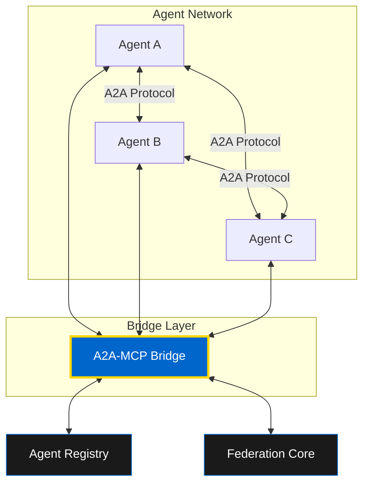

# Inter-Agent Communication: A2A Protocol

Learn how OMEGA agents discover, communicate, and collaborate using the Agent-to-Agent (A2A) protocol and the A2A-MCP Bridge.

## 🌐 What is A2A?

The **Agent-to-Agent (A2A) Protocol** enables seamless communication between agents in the OMEGA ecosystem. Combined with the **Model Context Protocol (MCP)**, it creates a unified interface for agent discovery and invocation.

### Key Capabilities

- 🔍 **Agent Discovery** - Find agents by capabilities
- 🔌 **Protocol Translation** - Bridge between A2A and MCP
- 📡 **Unified Communication** - Single interface for all agents
- 🏛️ **Pantheon Access** - Coordinate the entire agent network



## 🌉 The A2A-MCP Bridge

The **A2AMCPBridge** (`a2a_mcp_bridge.py`) provides a unified interface to discover, call, and coordinate all registered agents - whether they're exposed as MCP tools or full A2A participants.

### Architecture

The bridge translates your intent into MCP tool calls and returns them in A2A-compatible format:

```python
from bridges.a2a_mcp_bridge import A2AMCPBridge

bridge = A2AMCPBridge(
    agent_registry_url="http://agent_registry:9401",
    federation_url="http://federation_core:9405"
)
```

---

## 1️⃣ Agent Discovery

### Discover All Agents

Find all available agents in the Pantheon:

```python
# Discover all agents
agents = await bridge.discover_agents_via_mcp()

# Returns:
[
    {
        "agent_id": "code_generator",
        "name": "Code Generator",
        "capabilities": ["code_generation", "python", "javascript"],
        "a2a_endpoint": "http://code-gen:8000/a2a",
        "mcp_endpoint": "http://code-gen:9000/mcp"
    },
    {
        "agent_id": "prompt_optimizer",
        "name": "Prompt Optimizer",
        "capabilities": ["prompt_enhancement", "ai_optimization"],
        "a2a_endpoint": "http://prompt-opt:8000/a2a",
        "mcp_endpoint": "http://prompt-opt:9000/mcp"
    }
]
```

### Filter by Capabilities

Discover agents with specific capabilities:

```python
# Find agents with creative and technical capabilities
agents = await bridge.discover_agents_via_mcp(
    capabilities=["creative_generation", "technical_validation"]
)
```

**Use Cases:**
- Task routing based on capabilities
- Dynamic agent selection
- Load balancing across similar agents
- Capability-based orchestration

---

## 2️⃣ Agent Invocation

### Call Any Agent Seamlessly

Invoke agents through the bridge without worrying about protocol details:

```python
# Call an agent via the bridge
response = await bridge.call_agent_via_mcp(
    agent_id="gpt_titan",
    message="Generate a brand story for OMEGA."
)

# The bridge:
# 1. Discovers the agent's endpoint
# 2. Translates your request to the appropriate protocol
# 3. Delivers as A2A if agent supports it
# 4. Returns the response in a consistent format
```

### Multi-Agent Queries

Query multiple agents in parallel:

```python
async def ask_pantheon(question: str):
    """Ask all capable agents the same question."""

    # Discover available agents
    agents = await bridge.discover_agents_via_mcp()

    # Query all agents in parallel
    results = []
    for agent in agents:
        resp = await bridge.call_agent_via_mcp(
            agent["agent_id"],
            question
        )
        results.append({
            "agent": agent["name"],
            "response": resp
        })

    return results
```

---

## 3️⃣ Protocol Translation

### MCP to A2A Conversion

The bridge automatically transforms MCP-discovered tools into A2A-compatible agent metadata:

```python
# MCP Tool Discovery
mcp_tools = await mcp_client.list_tools()

# Bridge converts to A2A format
a2a_agents = bridge.convert_mcp_to_a2a(mcp_tools)

# Result: Every MCP tool is now pantheon-addressable
```

### Protocol Hints

Pass protocol flags to control agent behavior:

```python
response = await bridge.call_agent_via_mcp(
    agent_id="code_generator",
    message="Generate FastAPI app",
    protocol="a2a"  # Hint to use A2A response format
)
```

---

## 4️⃣ Real-World Patterns

### Pattern 1: Capability-Based Routing

Route tasks to the most capable agent:

```python
async def route_task(task: dict):
    """Route task to best agent based on capabilities."""

    # Extract required capabilities from task
    required_caps = task.get("capabilities", [])

    # Discover matching agents
    agents = await bridge.discover_agents_via_mcp(
        capabilities=required_caps
    )

    if not agents:
        raise ValueError("No agents with required capabilities")

    # Select best agent (could use scoring logic)
    best_agent = agents[0]

    # Execute task
    return await bridge.call_agent_via_mcp(
        agent_id=best_agent["agent_id"],
        message=task["description"]
    )
```

### Pattern 2: Distributed Consensus

Achieve consensus across multiple agents:

```python
async def get_consensus(question: str, threshold: float = 0.7):
    """Get consensus answer from multiple agents."""

    agents = await bridge.discover_agents_via_mcp(
        capabilities=["analysis", "reasoning"]
    )

    # Collect responses
    responses = []
    for agent in agents:
        resp = await bridge.call_agent_via_mcp(
            agent["agent_id"],
            question
        )
        responses.append(resp)

    # Calculate consensus (simplified)
    consensus_response = most_common(responses)
    confidence = responses.count(consensus_response) / len(responses)

    if confidence >= threshold:
        return consensus_response
    else:
        raise ValueError("No consensus reached")
```

### Pattern 3: Agent Orchestration

Coordinate multiple agents for complex tasks:

```python
async def orchestrate_content_creation(topic: str):
    """Orchestrate multiple agents to create content."""

    # Step 1: Optimize the prompt
    optimized = await bridge.call_agent_via_mcp(
        agent_id="prompt_optimizer",
        message=f"Optimize this content request: {topic}"
    )

    # Step 2: Generate content
    content = await bridge.call_agent_via_mcp(
        agent_id="content_generator",
        message=optimized["optimized_prompt"]
    )

    # Step 3: Review for quality
    review = await bridge.call_agent_via_mcp(
        agent_id="content_reviewer",
        message=f"Review this content: {content}"
    )

    # Step 4: Apply improvements
    final = await bridge.call_agent_via_mcp(
        agent_id="content_editor",
        message=f"Apply these improvements: {review['suggestions']}"
    )

    return final
```

---

## 5️⃣ Complete Example: Pantheon Query System

Build a system that queries all available agents:

```python
from bridges.a2a_mcp_bridge import A2AMCPBridge
from typing import List, Dict

class PantheonQuerySystem:
    def __init__(self):
        self.bridge = A2AMCPBridge(
            agent_registry_url="http://agent_registry:9401",
            federation_url="http://federation_core:9405"
        )

    async def get_all_agents(self) -> List[Dict]:
        """Get complete Pantheon census."""
        return await self.bridge.discover_agents_via_mcp()

    async def query_by_capability(self, capability: str) -> List[Dict]:
        """Find agents with specific capability."""
        return await self.bridge.discover_agents_via_mcp(
            capabilities=[capability]
        )

    async def broadcast_query(self, question: str) -> List[Dict]:
        """Ask all agents the same question."""
        agents = await self.get_all_agents()

        results = []
        for agent in agents:
            try:
                resp = await self.bridge.call_agent_via_mcp(
                    agent_id=agent["agent_id"],
                    message=question
                )
                results.append({
                    "agent": agent["name"],
                    "agent_id": agent["agent_id"],
                    "response": resp,
                    "success": True
                })
            except Exception as e:
                results.append({
                    "agent": agent["name"],
                    "agent_id": agent["agent_id"],
                    "error": str(e),
                    "success": False
                })

        return results

    async def execute_workflow(self, workflow: List[Dict]) -> Dict:
        """Execute a multi-agent workflow."""
        results = {}

        for step in workflow:
            agent_id = step["agent_id"]
            message = step["message"]

            # Replace placeholders with previous results
            for key, value in results.items():
                message = message.replace(f"{{{key}}}", str(value))

            # Execute step
            resp = await self.bridge.call_agent_via_mcp(
                agent_id=agent_id,
                message=message
            )

            results[step["output_key"]] = resp

        return results

# Usage
async def main():
    pantheon = PantheonQuerySystem()

    # Get all agents
    all_agents = await pantheon.get_all_agents()
    print(f"Found {len(all_agents)} agents in Pantheon")

    # Query by capability
    code_agents = await pantheon.query_by_capability("code_generation")
    print(f"Code generation agents: {len(code_agents)}")

    # Broadcast query
    responses = await pantheon.broadcast_query(
        "What is your primary capability?"
    )
    for r in responses:
        print(f"{r['agent']}: {r['response']}")

    # Execute workflow
    workflow = [
        {
            "agent_id": "prompt_optimizer",
            "message": "Optimize: build a REST API",
            "output_key": "optimized_prompt"
        },
        {
            "agent_id": "code_generator",
            "message": "{optimized_prompt}",
            "output_key": "generated_code"
        }
    ]
    result = await pantheon.execute_workflow(workflow)
    print(result)
```

---

## 🔐 Security & Best Practices

### 1. Authentication
Always authenticate agent-to-agent communication:

```python
bridge = A2AMCPBridge(
    agent_registry_url="http://agent_registry:9401",
    federation_url="http://federation_core:9405",
    auth_token=os.getenv("OMEGA_AUTH_TOKEN")
)
```

### 2. Error Handling
Implement robust error handling:

```python
try:
    resp = await bridge.call_agent_via_mcp(agent_id, message)
except AgentNotFoundError:
    # Agent doesn't exist
    pass
except AgentUnavailableError:
    # Agent is down
    pass
except ProtocolError:
    # Protocol mismatch
    pass
```

### 3. Timeouts
Set appropriate timeouts for agent calls:

```python
resp = await asyncio.wait_for(
    bridge.call_agent_via_mcp(agent_id, message),
    timeout=30.0
)
```

---

## 📚 Next Steps

- [Tool Development](/docs/developer/tools/creating-tools) - Build tools for your agents
- [MCP Integration](/docs/developer/integration/mcp/overview) - Deep dive into MCP
- [Federation Architecture](/docs/developer/integration/fastmcp/overview) - FastMCP federation

**🏛️ With A2A, every agent is connected. The Pantheon moves as one.**
