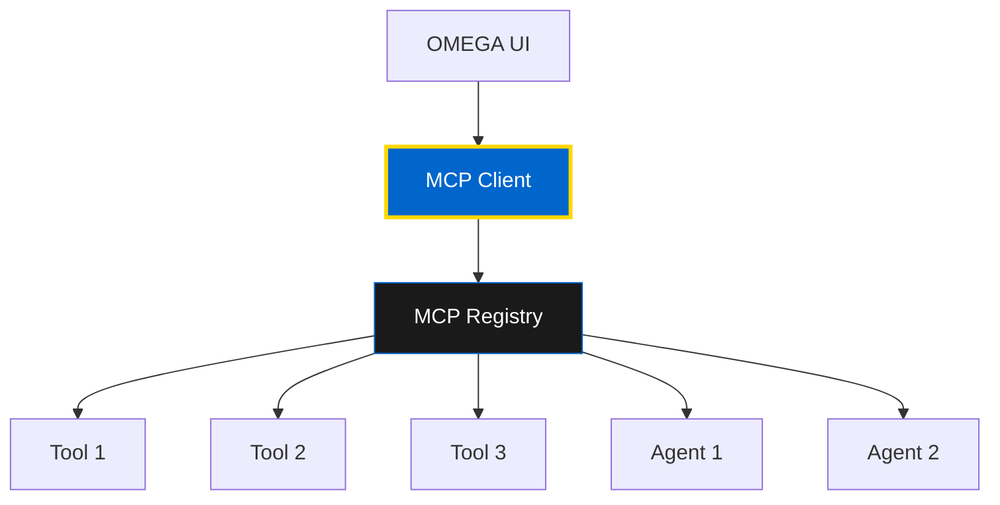

# MCP Integration: Model Context Protocol

Learn how to integrate the Model Context Protocol (MCP) into your applications for seamless communication with OMEGA agents and tools.

## 🔌 What is MCP?

The **Model Context Protocol (MCP)** is a standardized communication protocol that enables AI models, tools, and agents to interoperate. It provides a structured way for components to discover each other's capabilities and exchange data.

### Key Features

- 🔍 **Tool Discovery** - Find and list available tools
- ⚡ **Tool Execution** - Call tools with parameters
- 📦 **Resource Management** - Access and manage resources
- 📝 **Prompt Templates** - Standardized prompt management
- 🤝 **Capability Sharing** - Expose and discover capabilities



---

## 🚀 Frontend Integration

### Step 1: Create MCP Client

Build a TypeScript MCP client for your UI:

```typescript
// src/lib/mcp/client.ts
import axios, { AxiosInstance } from 'axios';

export interface McpTool {
  id: string;
  name: string;
  description: string;
  capabilities: McpCapability[];
  mcp_endpoint: string;
  host: string;
  port: number;
  tags: string[];
}

export interface McpCapability {
  name: string;
  description: string;
  parameters: Record<string, any>;
  returns?: Record<string, any>;
}

export class McpClient {
  private axiosInstance: AxiosInstance;
  private registryUrl: string;

  constructor(registryUrl: string) {
    this.registryUrl = registryUrl;
    this.axiosInstance = axios.create({
      baseURL: registryUrl,
      headers: {
        'Content-Type': 'application/json',
      },
    });
  }

  // Discover all MCP tools
  async discoverTools(): Promise<McpTool[]> {
    const response = await this.axiosInstance.get('/mcp/discover');
    return response.data;
  }

  // Get specific tool by ID
  async getToolById(toolId: string): Promise<McpTool> {
    const response = await this.axiosInstance.get(`/mcp/discover/${toolId}`);
    return response.data;
  }

  // Discover tools by capability
  async discoverToolsByCapability(capability: string): Promise<McpTool[]> {
    const response = await this.axiosInstance.get(
      `/mcp/discover/capability/${capability}`
    );
    return response.data;
  }

  // Call a tool
  async callTool(
    toolEndpoint: string,
    toolName: string,
    params: Record<string, any>
  ): Promise<any> {
    const response = await axios.post(toolEndpoint, {
      name: toolName,
      parameters: params
    });
    return response.data;
  }

  // Find and call tool by ID
  async findAndCallTool(
    toolId: string,
    toolName: string,
    params: Record<string, any>
  ): Promise<any> {
    const tool = await this.getToolById(toolId);
    if (!tool) {
      throw new Error(`Tool ${toolId} not found`);
    }
    return this.callTool(tool.mcp_endpoint, toolName, params);
  }

  // Register a new tool
  async registerTool(toolData: Omit<McpTool, 'mcp_endpoint'>): Promise<McpTool> {
    const response = await this.axiosInstance.post('/mcp/register', toolData);
    return response.data;
  }

  // Send heartbeat
  async sendHeartbeat(toolId: string): Promise<void> {
    await this.axiosInstance.post('/mcp/heartbeat', { id: toolId });
  }

  // Unregister tool
  async unregisterTool(toolId: string): Promise<void> {
    await this.axiosInstance.delete(`/mcp/unregister/${toolId}`);
  }
}

// Singleton instance
export const mcpClient = new McpClient(
  process.env.NEXT_PUBLIC_MCP_REGISTRY_URL || 'http://localhost:8080/registry'
);
```

### Step 2: React Hooks

Create React hooks for easy MCP usage:

```typescript
// src/hooks/use-mcp-tools.ts
import { useQuery, useMutation } from '@tanstack/react-query';
import { mcpClient, McpTool } from '@/lib/mcp/client';

export function useMcpTools() {
  return useQuery({
    queryKey: ['mcp', 'tools'],
    queryFn: () => mcpClient.discoverTools(),
  });
}

export function useMcpToolById(toolId: string) {
  return useQuery({
    queryKey: ['mcp', 'tool', toolId],
    queryFn: () => mcpClient.getToolById(toolId),
    enabled: !!toolId,
  });
}

export function useMcpToolsByCapability(capability: string) {
  return useQuery({
    queryKey: ['mcp', 'capability', capability],
    queryFn: () => mcpClient.discoverToolsByCapability(capability),
    enabled: !!capability,
  });
}

export function useCallMcpTool() {
  return useMutation({
    mutationFn: async ({
      toolEndpoint,
      toolName,
      params
    }: {
      toolEndpoint: string;
      toolName: string;
      params: Record<string, any>;
    }) => {
      return mcpClient.callTool(toolEndpoint, toolName, params);
    },
  });
}

export function useRegisterMcpTool() {
  return useMutation({
    mutationFn: (toolData: Omit<McpTool, 'mcp_endpoint'>) => {
      return mcpClient.registerTool(toolData);
    },
  });
}
```

### Step 3: UI Components

Build components using the hooks:

```tsx
// src/components/mcp-tools-list.tsx
import { useMcpTools } from '@/hooks/use-mcp-tools';
import { Card, CardHeader, CardTitle, CardContent } from '@/components/ui/card';
import { Badge } from '@/components/ui/badge';

export function McpToolsList() {
  const { data: tools, isLoading, error } = useMcpTools();

  if (isLoading) return <div>Loading tools...</div>;
  if (error) return <div>Error loading tools: {error.message}</div>;

  return (
    <div className="grid grid-cols-1 md:grid-cols-2 lg:grid-cols-3 gap-4">
      {tools?.map((tool) => (
        <Card key={tool.id}>
          <CardHeader>
            <CardTitle>{tool.name}</CardTitle>
          </CardHeader>
          <CardContent>
            <p className="text-sm text-muted-foreground mb-4">
              {tool.description}
            </p>

            <div className="flex flex-wrap gap-2 mb-4">
              {tool.tags.map((tag) => (
                <Badge key={tag} variant="secondary">
                  {tag}
                </Badge>
              ))}
            </div>

            <div className="text-xs text-muted-foreground">
              <div>Endpoint: {tool.mcp_endpoint}</div>
              <div>Capabilities: {tool.capabilities.length}</div>
            </div>
          </CardContent>
        </Card>
      ))}
    </div>
  );
}
```

### Step 4: Tool Invocation Component

```tsx
// src/components/mcp-tool-caller.tsx
import { useState } from 'react';
import { useCallMcpTool } from '@/hooks/use-mcp-tools';
import { Button } from '@/components/ui/button';
import { Input } from '@/components/ui/input';
import { Textarea } from '@/components/ui/textarea';

export function McpToolCaller({ tool }: { tool: McpTool }) {
  const [params, setParams] = useState('{}');
  const [result, setResult] = useState<any>(null);
  const callTool = useCallMcpTool();

  const handleCall = async () => {
    try {
      const parsedParams = JSON.parse(params);
      const response = await callTool.mutateAsync({
        toolEndpoint: tool.mcp_endpoint,
        toolName: tool.name,
        params: parsedParams,
      });
      setResult(response);
    } catch (error) {
      setResult({ error: error.message });
    }
  };

  return (
    <div className="space-y-4">
      <div>
        <label className="text-sm font-medium">Parameters (JSON)</label>
        <Textarea
          value={params}
          onChange={(e) => setParams(e.target.value)}
          placeholder='{"param1": "value1"}'
          className="font-mono"
        />
      </div>

      <Button onClick={handleCall} disabled={callTool.isPending}>
        {callTool.isPending ? 'Calling...' : 'Call Tool'}
      </Button>

      {result && (
        <div>
          <label className="text-sm font-medium">Result</label>
          <pre className="bg-muted p-4 rounded-md overflow-auto">
            {JSON.stringify(result, null, 2)}
          </pre>
        </div>
      )}
    </div>
  );
}
```

---

## 🔧 Backend Integration

### Python MCP Server

Create an MCP server in Python:

```python
from fastapi import FastAPI, HTTPException
from pydantic import BaseModel
from typing import Dict, Any, List
import httpx

app = FastAPI()

class McpToolCall(BaseModel):
    name: str
    parameters: Dict[str, Any]

class McpTool(BaseModel):
    id: str
    name: str
    description: str
    capabilities: List[Dict[str, Any]]
    host: str
    port: int
    tags: List[str]

# MCP Registry Client
class McpRegistryClient:
    def __init__(self, registry_url: str):
        self.registry_url = registry_url

    async def register_tool(self, tool: McpTool):
        async with httpx.AsyncClient() as client:
            response = await client.post(
                f"{self.registry_url}/mcp/register",
                json=tool.dict()
            )
            return response.json()

    async def heartbeat(self, tool_id: str):
        async with httpx.AsyncClient() as client:
            await client.post(
                f"{self.registry_url}/mcp/heartbeat",
                json={"id": tool_id}
            )

# Tool endpoint
@app.post("/mcp/call")
async def call_tool(tool_call: McpToolCall):
    """Handle MCP tool calls."""
    # Your tool logic here
    return {
        "result": "Tool executed successfully",
        "data": tool_call.parameters
    }

# Register on startup
@app.on_event("startup")
async def register_with_mcp():
    registry = McpRegistryClient("http://mcp-registry:8080/registry")

    tool = McpTool(
        id="my_tool",
        name="My Tool",
        description="Example MCP tool",
        capabilities=[
            {
                "name": "process",
                "description": "Process data",
                "parameters": {"data": "string"}
            }
        ],
        host="my-tool",
        port=8000,
        tags=["example", "processing"]
    )

    await registry.register_tool(tool)
```

---

## 🎯 Real-World Examples

### Example 1: Tool Discovery Dashboard

```tsx
import { useMcpTools, useMcpToolsByCapability } from '@/hooks/use-mcp-tools';

export function ToolDiscoveryDashboard() {
  const { data: allTools } = useMcpTools();
  const { data: codeTools } = useMcpToolsByCapability('code_generation');

  return (
    <div>
      <h2>All Tools ({allTools?.length || 0})</h2>
      <McpToolsList tools={allTools} />

      <h2>Code Generation Tools ({codeTools?.length || 0})</h2>
      <McpToolsList tools={codeTools} />
    </div>
  );
}
```

### Example 2: Dynamic Tool Execution

```tsx
export function DynamicToolExecutor() {
  const [selectedCapability, setSelectedCapability] = useState('');
  const { data: tools } = useMcpToolsByCapability(selectedCapability);
  const callTool = useCallMcpTool();

  const executeOnAllTools = async (params: Record<string, any>) => {
    const results = await Promise.all(
      tools?.map(tool =>
        callTool.mutateAsync({
          toolEndpoint: tool.mcp_endpoint,
          toolName: tool.name,
          params
        })
      ) || []
    );
    return results;
  };

  return (
    <div>
      <CapabilitySelector onChange={setSelectedCapability} />
      <ToolsList tools={tools} onExecute={executeOnAllTools} />
    </div>
  );
}
```

---

## 🔐 Security Best Practices

### 1. Authentication

```typescript
export class SecureMcpClient extends McpClient {
  constructor(registryUrl: string, private apiKey: string) {
    super(registryUrl);
    this.axiosInstance.defaults.headers.common['Authorization'] = `Bearer ${apiKey}`;
  }
}
```

### 2. Input Validation

```typescript
async callTool(endpoint: string, name: string, params: any) {
  // Validate parameters
  if (!this.validateParams(params)) {
    throw new Error('Invalid parameters');
  }

  // Sanitize endpoint
  if (!this.isTrustedEndpoint(endpoint)) {
    throw new Error('Untrusted endpoint');
  }

  return super.callTool(endpoint, name, params);
}
```

### 3. Rate Limiting

```typescript
export function useThrottledMcpCall(delay: number = 1000) {
  const callTool = useCallMcpTool();

  return useMemo(
    () => throttle(callTool.mutateAsync, delay),
    [callTool, delay]
  );
}
```

---

## 📚 Next Steps

- [FastMCP Integration](/docs/developer/integration/fastmcp/overview) - Service discovery
- [A2A Protocol](/docs/developer/agents/a2a) - Agent-to-agent communication
- [Backend Integration](/docs/intro) - Server-side MCP

**🏛️ MCP powers the OMEGA ecosystem - connect everything, seamlessly.**
