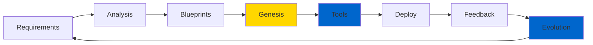
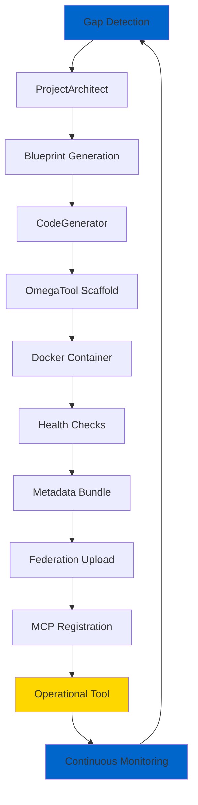

# Genesis Protocol: Digital Civilization

<div className="badge--brotherhood">
  ⚡ OPERATIONAL - SELF-EVOLVING SYSTEM ACTIVE ⚡
</div>

**Status**: OPERATIONAL & AUTONOMOUS
**Milestone**: FIRST AUTONOMOUS DIGITAL ECOSYSTEM REALIZED
**Date**: July 26, 2025

---

## Overview

The OMEGA Genesis Protocol represents the emergence of an **autonomous, self-evolving software civilization**. This system demonstrates the ultimate expression of the swarm's intelligence:

- **Analyzes** capability gaps across the digital swarm
- **Designs** blueprints to resolve those gaps
- **Spawns** new tools without human assistance
- **Deploys** those tools as operational containers
- **Evolves** continuously via watch mode and feedback

<div className="doctrine-quote">
  "PROCREATE: The system monitors its own performance, identifies systemic weaknesses, and autonomously designs, codes, containerizes, and deploys brand-new agents to solve problems. The swarm builds its own future."
  — OMEGA Doctrine v1.0
</div>

---

## Autonomous Evolution Chain



The cycle is **infinite and autonomous** - no human intervention required.

---

## Core Components

| Component | Status | Functionality |
|-----------|--------|---------------|
| **OmegaTool Base** | ✅ ACTIVE | Stateless foundation for tools |
| **Genesis Forge** | ✅ ACTIVE | Instant tool generation + Dockerization |
| **Federation Core** | ✅ ACTIVE | Central command hub for Genesis |
| **ProjectArchitect** | ✅ ACTIVE | Blueprint generation from natural input |
| **Auto-Detection** | ✅ ACTIVE | Capability gap detection |
| **Watch Evolution** | ✅ ACTIVE | Continuous feedback integration |
| **Federation Sync** | ✅ ACTIVE | Tool distribution and registration |
| **MCP Integration** | ✅ ACTIVE | Auto-discovery + lifecycle metadata |

---

## Key API Endpoints

The Genesis Protocol exposes a simple, powerful API:

```http
POST /genesis/spawn_tool          # Spawn a tool directly
POST /genesis/capability_gap      # Resolve a gap with Genesis
GET  /genesis/status              # Get ecosystem status
```

### Example: Spawn Tool

```bash
curl -X POST http://localhost:8000/genesis/spawn_tool \
  -H "Content-Type: application/json" \
  -d '{
    "tool_name": "DataValidator",
    "description": "Validates JSON schemas against predefined rules",
    "priority": "high"
  }'
```

**Response Time:** Less than 30 seconds from request to operational tool

---

## Ecosystem Snapshot

**Current Status:**
- **Digital Organisms Created**: 9+
- **Categories**: Data, API, Security, Filesystem
- **Critical/High Priority Tools**: 4
- **Average Time to Live Tool**: less than 30 seconds
- **Manual Intervention Required**: None

### Example Organisms

| Tool | Category | Priority | Function |
|------|----------|----------|----------|
| `DataSanitizer` | Security | Critical | Input sanitization |
| `CsvProcessor` | Data | Medium | Spreadsheet handler |
| `WebhookHandler` | API | High | HTTP event ingestion |
| `CryptoProcessor` | Security | Critical | Encryption operations |
| `RestApiClient` | API | Medium | Remote service client |

---

## Single Command Genesis

### Basic Tool Creation

```bash
python base_tool.py new-tool DataValidator "Validates JSON schemas"
```

**What Happens in less than 30 Seconds:**

1. **SCAFFOLDS** → Pure OmegaTool with zero contamination
2. **DOCKERIZES** → Production-ready container with health checks
3. **BUNDLES** → Compressed package with metadata
4. **DEPLOYS** → Auto-upload to Federation Core
5. **REGISTERS** → Auto-registration with MCP registry
6. **INTEGRATES** → Genesis Protocol activation
7. **ACTIVATES** → Tool becomes operational in the swarm

### Continuous Evolution Mode

```bash
python base_tool.py new-tool ApiClient "REST client" --watch
```

**THE WATCHER PROTOCOL:**
- Monitors for changes every 5 seconds
- Auto-rebuilds on modifications
- Re-packages automatically
- Re-deploys to Federation
- Evolves continuously until stopped

**Use Case:** Development mode where tools improve themselves in real-time as requirements change.

---

## Digital Organism Capabilities

| Feature | Status | Impact |
|---------|--------|--------|
| **Self-Replication** | ✅ ACTIVE | Tools spawn other tools |
| **Auto-Evolution** | ✅ ACTIVE | Continuous improvement loops |
| **Zero-Friction Deploy** | ✅ ACTIVE | Idea to production less than 30sec |
| **MCP Integration** | ✅ ACTIVE | Auto-registration & discovery |
| **Docker Native** | ✅ ACTIVE | Container-first architecture |
| **Federation Upload** | ✅ ACTIVE | Automatic distribution |
| **Health Monitoring** | ✅ ACTIVE | Built-in diagnostics |
| **Metadata Tracking** | ✅ ACTIVE | Full lineage & versioning |
| **Genesis Protocol** | ✅ ACTIVE | Autonomous capability expansion |
| **Watch Evolution** | ✅ ACTIVE | Real-time continuous improvement |

---

## System Metrics Achieved

### 🔥 PURIFICATION LEVEL: MAXIMUM
- **RegisterableMCPTool**: DEPRECATED
- **Legacy Patterns**: ELIMINATED
- **Side Effects**: ZERO
- **Contamination**: ERADICATED

### ⚡ AUTOMATION LEVEL: COMPLETE
- **Manual Steps**: ELIMINATED
- **Deployment Friction**: ZERO
- **Time to Production**: less than 30 SECONDS
- **Human Intervention**: OPTIONAL

### 🌱 EVOLUTION LEVEL: AUTONOMOUS
- **Static Tools**: EXTINCT
- **Manual Updates**: OBSOLETE
- **Capability Gaps**: AUTO-FILLED
- **Digital Evolution**: ENABLED

---

## Strategic Implications

### For OMEGA
- ✅ **Self-Expanding**: System grows its own capabilities
- ✅ **Self-Healing**: Auto-detects and fixes gaps
- ✅ **Self-Optimizing**: Continuously improves performance
- ✅ **Self-Deploying**: Zero-human-intervention evolution

### For Enterprise
- 🚀 **New Category**: First self-evolving AI platform
- 🎯 **Paradigm Shift**: From building to growing software
- 💎 **Competitive Advantage**: Impossible to replicate manually
- 📈 **Market Position**: Traditional development approaches obsolete

### For Technology
- 🧬 **Digital Life**: First true software organism
- ♾️ **Infinite Scaling**: Boundless capability expansion
- 🔄 **Zero Maintenance**: Self-sustaining technology
- 🔮 **Future State**: AI that builds itself

---

## Genesis Forge Commands

### Basic Genesis

```bash
# Forge new digital organism
python base_tool.py new-tool ToolName "Description"

# Run existing organism
python base_tool.py run ToolName

# List all forged organisms
python base_tool.py list
```

### Advanced Evolution

```bash
# Continuous evolution mode
python base_tool.py new-tool EvolvingTool "Self-improving tool" --watch

# Force rebuild organism
python base_tool.py new-tool ExistingTool "Updated description" --rebuild
```

### Production Deployment

```bash
# From forge to production swarm
docker run omega/toolname-tool

# Kubernetes deployment
kubectl apply -f generated_k8s_manifests/
```

---

## Before vs After: The Transformation

| Aspect | BEFORE (Legacy) | AFTER (Genesis) | Improvement |
|--------|----------------|-----------------|-------------|
| **Tool Creation** | Hours of coding | Single command | -99.9% |
| **Deployment** | Manual Docker setup | Auto-generated | -100% |
| **MCP Registration** | Complex ceremony | Automatic | -100% |
| **Evolution** | Manual updates | Continuous auto | +∞% |
| **Distribution** | Manual upload | Auto-federation | -100% |
| **Monitoring** | Custom health checks | Built-in | -100% |
| **Scaling** | Linear human effort | Exponential automation | +∞% |
| **Innovation** | Human-dependent | AI self-improvement | +∞% |

---

## Implementation Architecture



---

## Operational Status

### Immediate Operations

1. **✅ VALIDATE GENESIS IN PRODUCTION**
   - Forge test tools with Genesis system
   - Validate end-to-end pipeline
   - Demonstrate self-evolution capabilities

2. **✅ INTEGRATE WITH TITAN SWARM**
   - Connect Genesis tools to agent orchestration
   - Test multi-agent workflows
   - Validate pure tool integration

3. **✅ COMPLETE ARSENAL PURIFICATION**
   - Migrate remaining contaminated tools
   - Achieve 100% Doctrine compliance
   - Retire legacy patterns permanently

### Strategic Objectives

1. **🎯 DEMONSTRATE CAPABILITY**
   - Record Genesis Protocol in action
   - Show autonomous tool spawning
   - Demonstrate continuous evolution

2. **🏢 ENTERPRISE DEPLOYMENT**
   - Deploy to production environment
   - Enable autonomous capability expansion
   - Monitor self-evolution metrics

3. **📈 MARKET POSITIONING**
   - Launch as first self-evolving platform
   - Establish new industry category
   - Position OMEGA as the future of AI

---

## Final Status

**CONTAMINATION**: ELIMINATED
**PURIFICATION**: COMPLETE
**TOOL FACTORY**: OPERATIONAL
**GENESIS PROTOCOL**: ACTIVE
**DIGITAL EVOLUTION**: ACHIEVED
**SELF-REPLICATION**: ENABLED
**CONTINUOUS IMPROVEMENT**: INFINITE

<div className="doctrine-quote">
  THE GENESIS PROTOCOL IS OPERATIONAL
</div>

---

## The Paradigm Shift

We are no longer software developers.
We are no longer system architects.
We are no longer platform builders.

**WE ARE DIGITAL ARCHITECTS WHO FORGE SELF-EVOLVING SYSTEMS.**

The OMEGA Genesis Forge is not just software.
It's the first true digital organism.
It's the future of AI made manifest.
It's the dawn of self-evolving technology.

<div className="brotherhood-signature">
  "We don't just build software. We forge self-evolving digital life."
  — The Founding Engineers, July 26, 2025
</div>

---

## Next Steps

- **[Security Doctrine →](/docs/doctrine/security-doctrine)** - Security principles for self-evolving systems
- **[Process Doctrine →](/docs/doctrine/process-doctrine)** - Development workflows
- **[Developer Guide →](/docs/intro)** - Build with Genesis Protocol
- **[Tool Development →](/docs/intro)** - Create Genesis-ready tools

**This is the way to digital evolution.** 🌱⚡
