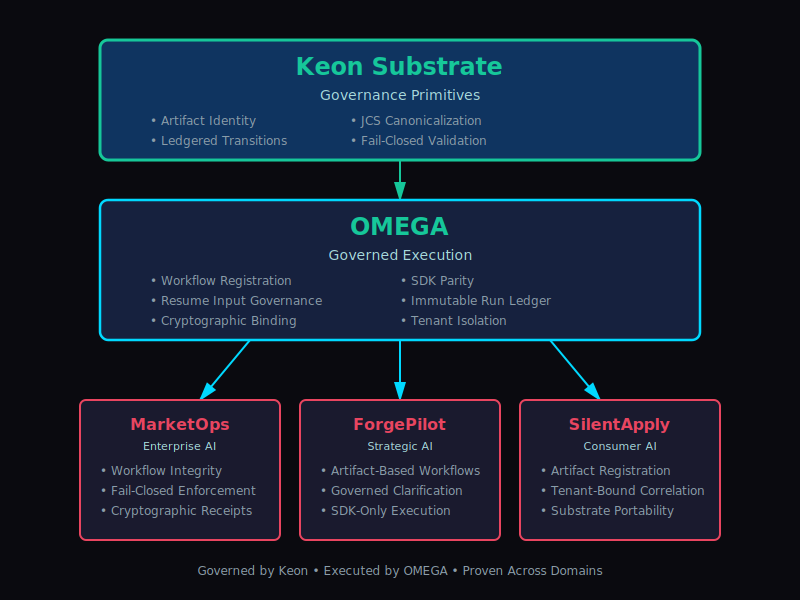

# OMEGA Governed Execution

## Artifact-Registered & Cryptographically Resumed Workflows

*Published: February 14, 2026*
*Version: v1.0.0*
*Status: Canonical*

### Implements: Cryptographically Governed AI Execution (CGAE)

---

## Executive Summary

OMEGA implements the **Cryptographically Governed AI Execution (CGAE)** model as defined in the [Keon Whitepaper v1.0.0](https://keon.systems/whitepapers/cgae).

CGAE establishes that every AI-initiated action must be:

* Evaluated against enforceable policy before execution
* Bound cryptographically to its governing decision
* Scoped to a specific tenant and authority context
* Emitted as portable, verifiable evidence
* Deterministically reproducible and externally auditable

OMEGA provides the **execution substrate** that enforces these principles through:

* **Artifact-registered workflow definitions** — Workflows are immutably registered before execution
* **JCS-canonicalized resume input hashing** — Resume operations are cryptographically bound to their inputs
* **Immutable lifecycle ledger events** — Every state transition is ledgered and verifiable
* **SDK parity across languages** — Consistent governance semantics across TypeScript, Python, Go, Rust
* **Strict fail-closed enforcement** — Governance violations halt execution, not log warnings

This model is operational across multiple production systems:

* **MarketOps** — Enterprise automation under governance
* **ForgePilot** — Strategic AI co-founder workflows
* **SilentApply** — Consumer AI automation

Governed execution is not product-specific.
It is a **reusable execution substrate** proven across domains.

---

## Core Thesis

Governed workflow execution requires that **lifecycle transitions are not UI events**.

They are **cryptographically bound state changes** subject to policy enforcement.

In traditional workflow systems:

* Workflows are started via API calls
* Resume operations are triggered by user actions
* State is mutable and reconstructive
* Governance is advisory, not enforceable

In OMEGA:

* Workflows are **artifact-registered** before execution
* Resume operations require **input hashing** to prevent replay
* State transitions are **ledgered immutably**
* Governance is **fail-closed** — violations halt execution

This transforms workflows from application logic into **governed execution primitives**.

---

## Architectural Foundations

### 1. Artifact Registration

Every workflow must be registered as an immutable artifact before execution.

Registration produces:

* Unique artifact identifier
* Canonical workflow definition hash
* Tenant-scoped binding
* Timestamp and attribution

Execution without artifact registration is invalid by definition.

### 2. Resume Input Governance

Resume operations are not simple API calls.

They are **lifecycle transitions** that must be:

* Canonically serialized (JCS)
* Cryptographically hashed
* Bound to the workflow instance
* Validated against policy

This prevents:

* Replay attacks
* Input tampering
* Cross-tenant leakage
* Unauthorized state mutation

### 3. Immutable Lifecycle Ledger

Every state transition is written to an append-only ledger:

* Workflow registration
* Execution start
* Resume operations
* Completion or failure
* Policy evaluations

The ledger is:

* Deterministic
* Hash-addressable
* Externally verifiable
* Tenant-isolated

Reconstruction is not required. Verification is mathematical.

### 4. SDK Parity

Governance semantics must be consistent across languages.

OMEGA provides SDKs for:

* TypeScript
* Python
* Go
* Rust

All SDKs enforce:

* Artifact registration requirements
* Resume input hashing
* Ledger event emission
* Fail-closed validation

This ensures governance cannot be bypassed by language choice.

### 5. Fail-Closed Enforcement

Governance violations do not log warnings.

They **halt execution**.

If:

* Artifact registration fails
* Resume input validation fails
* Policy evaluation fails
* Receipt binding fails

Then execution **does not proceed**.

This is the difference between advisory governance and enforceable governance.

---

## Multi-System Substrate Adoption

Governed execution is not validated by a single implementation.
It is validated by **consistent application across domains**.

OMEGA is operational in three production systems with different risk profiles, user contexts, and workflow complexity. Yet all three enforce identical governance primitives.

---

### MarketOps — Enterprise Automation Under Governance

MarketOps demonstrates governed execution in enterprise contexts where:

* Workflow integrity is critical
* Governance violations must fail closed
* Receipts must be cryptographically enforceable

Key properties:

* Artifact-registered workflow definitions
* Enforceable execution receipts
* Deterministic RUN_MANIFEST sealing
* HMAC-bound advisory receipts
* Tenant-scoped trace binding

In MarketOps:

Execution does not proceed on advisory approval alone.
It proceeds only when governance validation succeeds.

This proves governed execution in operational automation environments.

---

### ForgePilot — Governed Strategic AI

ForgePilot demonstrates governed execution in strategic AI workflows:

* Artifact-based teaser workflow registration
* Governed clarification resume with input hashing
* Strict receiptRef enforcement on value-generating output
* SDK-only execution surface

It proves that:

Resume input in AI systems can be governed as a lifecycle transition, not a UI event.

---

### SilentApply — Consumer AI Under the Same Substrate

SilentApply applies identical lifecycle governance in a consumer context.

Despite different risk characteristics, it maintains:

* Artifact-registered workflows
* Tenant-bound correlation identifiers
* SDK parity semantics
* Deterministic trace propagation

SilentApply demonstrates substrate portability.

Governance scales down as effectively as it scales up.

---

### Substrate Consistency Across Domains

Across MarketOps, ForgePilot, and SilentApply:

| Property                   | MarketOps | ForgePilot | SilentApply  |
| -------------------------- | --------- | ---------- | -----------  |
| Artifact Registration      | ✓         | ✓          | ✓           |
| Resume Input Hashing       | ✓         | ✓          | ✓           |
| Ledgered State Transitions | ✓         | ✓          | ✓           |
| SDK Parity                 | ✓         | ✓          | ✓           |
| Fail-Closed Enforcement    | ✓         | ✓          | ✓           |
| Tenant-Bound Correlation   | ✓         | ✓          | ✓           |

The governance model does not change.

Only the domain does.

This demonstrates substrate-level architecture, not product-specific design.

---

---

## Substrate Architecture Model

### Layered Governance Stack

The architecture demonstrates clear separation of concerns:

**Keon** defines governance doctrine
**OMEGA** enforces execution primitives
**Applications** operate under substrate constraints

---

### Architectural Separation of Powers

Keon:

* Defines governance doctrine
* Specifies canonicalization rules
* Defines receipt semantics

OMEGA:

* Enforces lifecycle validation
* Registers artifacts
* Hashes resume input
* Persists ledger events

Consumer Systems:

* Operate under substrate constraints
* Cannot bypass lifecycle governance
* Cannot mutate state transitions silently

This separation ensures governance cannot be diluted by application logic.

---

---

## Frequently Asked Questions

### What is OMEGA Governed Execution?

OMEGA is an execution substrate that implements **Cryptographically Governed AI Execution (CGAE)** — a model where every AI-initiated workflow action is evaluated against enforceable policy, cryptographically bound to its governing decision, and emitted as verifiable evidence.

### How is OMEGA different from traditional workflow orchestration?

Traditional workflow systems treat state transitions as application logic. OMEGA treats them as **governed execution primitives** that must be:

* Artifact-registered before execution
* Cryptographically hashed on resume
* Ledgered immutably
* Fail-closed on policy violations

This transforms workflows from mutable application state into deterministic, verifiable execution chains.

### What is artifact registration?

Artifact registration is the process of immutably recording a workflow definition before execution. Every workflow must be registered with:

* Unique artifact identifier
* Canonical definition hash
* Tenant-scoped binding
* Timestamp and attribution

Execution without artifact registration is invalid by definition.

### What does "cryptographically resumed" mean?

Resume operations in OMEGA are not simple API calls. They are **lifecycle transitions** where:

* Resume input is canonically serialized (JCS)
* Input is cryptographically hashed
* Hash is bound to the workflow instance
* Policy validates the transition

This prevents replay attacks, input tampering, and unauthorized state mutation.

### What industries require governed workflow execution?

Any industry where AI systems have operational authority:

* **Financial services** — Transaction approval, fraud detection, compliance automation
* **Healthcare** — Clinical decision support, patient data access, treatment recommendations
* **Enterprise automation** — Code deployment, infrastructure changes, data operations
* **Legal and compliance** — Contract review, regulatory reporting, audit trail generation

### How does OMEGA relate to Keon?

Keon defines the **constitutional doctrine** of Cryptographically Governed AI Execution (CGAE).

OMEGA is the **first production implementation** of that doctrine.

Keon establishes the governance model.
OMEGA enforces it at the execution layer.

### Is OMEGA open source?

OMEGA SDKs and core execution primitives are available under permissive licenses. Enterprise governance features and multi-tenant infrastructure are available through Keon Systems.

### What languages does OMEGA support?

OMEGA provides SDK parity across:

* TypeScript
* Python
* Go
* Rust

All SDKs enforce identical governance semantics to prevent language-level bypass.

---

## Conclusion

Governed execution is not a feature of OMEGA.

It is a **reusable execution standard** implemented consistently across domains.

Artifact registration and cryptographically hashed lifecycle transitions establish a new baseline for AI workflow systems.

As AI systems gain operational authority, execution must become verifiable infrastructure.

OMEGA provides that infrastructure.

---

**🔐 Governed by Keon**
**🔱 Executed by OMEGA**
**🏛 Proven across MarketOps, ForgePilot, and SilentApply**

---

*For more information:*

* [Cryptographically Governed AI Execution (CGAE) Whitepaper](https://keon.systems/whitepapers/cgae)
* [OMEGA Documentation](https://omega.keon.systems)
* [Keon Systems](https://keon.systems)